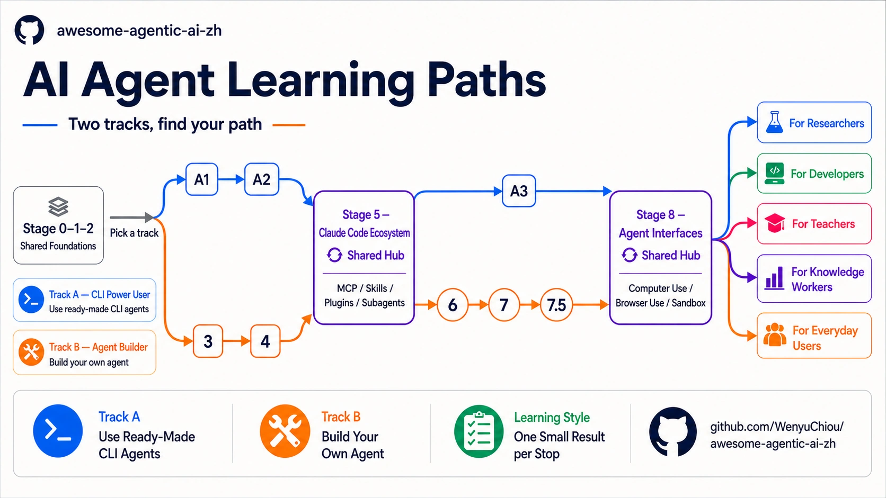
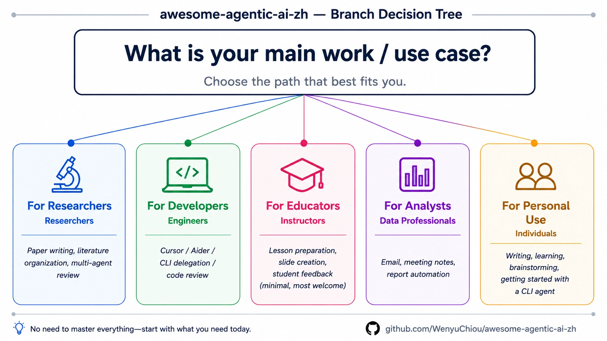

<div align="right">
  <a href="./README.md">繁體中文</a> | <a href="./README.zh-Hans.md">简体中文</a> | <strong>English</strong>
</div>

<div align="center" markdown="1">



# awesome-agentic-ai-zh

<p><strong>🤖 AI Agent Learning Roadmap — from basic LLM concepts to building your own multi-agent systems</strong></p>

<p><em><b>Learning roadmap + curated resources + small runnable examples</b><br/>Eight topic stages, plus the Stage 0 readiness check and the Stage 7.5 advanced reading stop; from "what is an LLM, how are tokens counted" to multi-agent orchestration, Computer Use / Browser Use / Sandbox</em></p>

[](LICENSE)
[](README.md)
[](README.zh-Hans.md)
[](README.en.md)


[](https://wenyuchiou.github.io/awesome-agentic-ai-zh/)

</div>

> 📱 **On a phone, read the [docs site](https://wenyuchiou.github.io/awesome-agentic-ai-zh/) rather than this page.**

> **Trilingual — the English edition is fully maintained, not a thin machine translation** (only ~0.4% of English lines carry any CJK, almost all intentional bilingual term-mapping). zh-TW is the curation source of truth (new content lands there first); the English and 简中 editions track the same structure, with CI checking localization correctness and anchor integrity across all three.

---

## 🎯 Why this exists

**What this repo is**: **a learning roadmap + curated resources + small runnable examples** — three pillars helping AI / AI-agent learners go from "I don't know where to start" to "I can design multi-agent systems."

Concretely:

| Pillar | What it does | Scale |
|---|---|---|
| **Learning roadmap** | Organizes scattered high-quality projects, tutorials, and required reading into **8 topic stages + the Stage 0 readiness check + the Stage 7.5 advanced reading stop**, then branches into 2 tracks and 5 role paths | 10 learning stops, 2 tracks |
| **Resource curation** | Each stage selects projects with official or canonical sources and explains the editorial rating, audience, lesson, limits, and how to run them; a task-based MCP / Skill catalog provides another entry point | Grouped by stage and task |
| **Small runnable examples** | Hands-on stages provide copyable **foundational exercises**, preserve Ollama / Anthropic paths when a model connection is needed, and check important behavior with offline or mock-based tests | Organized by learning outcome |

After the main path, you go from "**LLM user**" to "**agent system builder**" — capable of designing multi-agent collaboration, writing your own MCP server, and shipping real agent systems.

---

## 📋 Table of Contents

- [🎯 Why this exists](#-why-this-exists)
- [📚 Quick Start](#-quick-start)
  - [Read online](#read-online)
  - [Local clone](#local-clone)
  - [✨ What you get](#-what-you-get)
- [🗺️ Learning Map (Two Tracks)](#-learning-map-two-tracks)
- [💡 How to Learn](#-how-to-learn)
- [📚 Related Resources](#-related-resources)
- [🤝 Contributing](#-contributing)
- [🙏 Acknowledgments](#-acknowledgments)
- [🎓 Citation](#-citation)
- [☕ Support this project](#-support-this-project)
- [License](#license)

---

## 📚 Quick Start

### 🚀 First time with AI agents / never written code before?

Start here: **[`resources/setup-guide.en.md`](resources/setup-guide.en.md)** — distinguish Web, Desktop, IDE, CLI Agent, and API first; choose one path, and do not install every tool.

### Read online
- **[Learning Map (Two Tracks)](#-learning-map-two-tracks)** — read this section to decide Track A or Track B
- **[Stage 0 Foundations](stages/00-foundations.en.md)** — already know Python / git / API? Skip straight to Stage 1

### Local clone
```bash
git clone https://github.com/WenyuChiou/awesome-agentic-ai-zh.git
cd awesome-agentic-ai-zh
# Start with stages/00-foundations.en.md
```

### ✨ What you get

- 📖 **Fully free** — MIT-licensed, all content open
- 🗺️ **Two learning tracks** — Track A (CLI Power User) teaches you to use an existing CLI agent to finish work; Track B (Agent Builder) teaches you to build your own agent from code. Both share the Stage 0–2 foundation
- 🛠️ **Foundational hands-on exercises** — Hands-on stages provide copyable exercises and a clear success check. When a model connection is needed, they also provide Ollama and Anthropic SDK paths. They help you start and confirm your route; for chapter-length practice, follow each Stage's hello-agents / Anthropic Cookbook links
- 🎯 **Curated projects** — each with an editorial rating, audience, lesson, limits, and how to run it (including local LLM runners: Ollama, llama.cpp, LocalAI, MLX)
- 🌏 **Trilingual, fully maintained** — zh-TW (canonical) / 简中 / English; the English edition is complete, not a thin mirror
- 🎓 **Beyond frameworks: Claude Code ecosystem** — MCP / Skills / Plugins / SDK full stack
- 🔬 **5 specialized branches** — researcher / developer / teacher / knowledge worker / **everyday user**
- 🧭 **One small result per stop** — first see what you will build; open the estimate below the route only when you need to plan your time

---

## 🗺 Learning Map (Two Tracks)


After **Stages 0-2 (shared foundations)**, pick a track based on your goal:

- **Track A — CLI Power User**: you want to **USE** existing CLI agents (Claude Code, Codex, OpenCode, Gemini CLI, etc.) to get work done — not build agents from scratch. 3 sub-stages (A1-A3).
- **Track B — Agent Builder**: you want to **BUILD** your own agents — learn frameworks, write ReAct, design multi-agent systems. Stages 3-8 main path.

The two tracks are **not mutually exclusive** — most people start with A to get hands-on, then come back to B for internals (or vice versa). Stage 5 (Claude Code Ecosystem) is used by both tracks.

### Shared Foundations (Stages 0-2)

| Stage | Topic | Key Content | What you can do afterward |
|---|---|---|---|
| **0** | [Foundations](stages/00-foundations.en.md) | Python · CLI · git · API · JSON | Run a small program and save the result with Git |
| **1** | [LLM Fundamentals](stages/01-llm-basics.en.md) | tokens · context · API · model comparison · local LLM | Read basic model specs and choose a sensible starting point |
| **2** | [Prompt Engineering](stages/02-prompt-engineering.en.md) | zero-shot · one-shot · few-shot · system prompt · CoT boundary | Write a prompt the model can understand and you can test again |

### Track A — CLI Power User (use CLIs to get work done)

| Stage | Topic | Key Content | What you can do afterward |
|---|---|---|---|
| **A1** | [CLI Agent Intro & Selection](tracks/cli/A1-cli-intro.en.md) | CLI agent selection · install · first run | Pick one tool and finish one real, small task |
| **A2** | [CLI Workflow Patterns](tracks/cli/A2-cli-workflow.en.md) | Project instructions · Skill · task decomposition | Turn one successful run into a repeatable workflow |
| **+5** | [Stage 5 — Claude Code Ecosystem](stages/05-claude-code-ecosystem.en.md) (**Shared Hub**) | MCP · Skills · Plugins · Subagents; Track A reads 5.1–5.4, with 5.5–5.8 optional | Give a CLI agent rules, tools, and delegated work |
| **A3** | [Integration & Production](tracks/cli/A3-cli-production.en.md) | MCP-into-CLI · CI automation · cost / observability | Connect a real workflow and see what the agent did |
| **+8** | [Stage 8 — Agent Interfaces](stages/08-agent-interfaces.en.md) (**Shared Hub**) | Computer Use · Browser Use · Code Sandbox | Decide whether a task needs a browser, computer control, or sandbox |

> **Capstone gate:** You can start the Track A Capstone after A3. Stage 8 is the recommended next stop, but it does not block Capstone entry.

### Track B — Agent Builder (build agents from scratch)

| Stage | Topic | Key Content | What you can do afterward |
|---|---|---|---|
| **3** ⭐ | [Tool Use & Your First Agent Loop](stages/03-tool-use-and-hello-agent.en.md) | function calling · ReAct · 6 hands-on exercises | Build an Agent Loop that calls a tool, reads the result, and continues |
| **4** | [Workflow Graphs & Agent Frameworks](stages/04-agent-frameworks.en.md) | Workflow Graph · LangGraph · AutoGen · CrewAI · Smolagents | Draw the workflow first, then choose a framework to build it |
| **5** ⭐⭐ | [Claude Code Ecosystem](stages/05-claude-code-ecosystem.en.md) (**Shared Hub**, Track A also studies) | MCP · Skills · Plugins · Subagents | Connect tools, rules, and delegation into one runnable system |
| **6** | [Context Engineering: RAG and Memory](stages/06-memory-rag.en.md) | retrieval · vector DB · long-term memory · contextual retrieval · evaluation | Help an agent find evidence and decide what is worth remembering |
| **7** | [Agent Production Engineering: Harness, Loops, and Graphs](stages/07-multi-agent-production.en.md) | advanced SDK · harness · loop · graph · multi-agent · eval · observability | Make the system inspectable and recoverable when it fails |
| **7.5** | [Advanced Agentic Workflow Concepts](stages/07.5-advanced-agentic-concepts.en.md) (reading map) | 12 advanced concepts + reading list · work boundary · PAR loop · agent-as-judge · graceful degradation | Decide whether the next advanced concept is actually needed |
| **8** ⭐⭐ | [Agent Interfaces](stages/08-agent-interfaces.en.md) (**Shared Hub**, Track A also studies) | Computer Use · Browser Use · Code Sandbox | Choose a safe, observable interface for the task |

<details markdown="1">
<summary>⏱️ View time estimates (planning aid, not a deadline)</summary>

Everyone starts in a different place. Finish one small result first, then decide whether you need another week for the basics.

- **Shared foundations:** Stage 0 takes about 1–2 weeks; Stage 1 about 1 week; Stage 2 about 1–2 weeks.
- **Track A:** A1 takes about 1 week; A2, Stage 5, A3, and Stage 8 take about 1–2 weeks each. Including the shared foundations, the full route is about 8–10 weeks.
- **Track B:** Stages 3, 4, and 8 take about 2–3 weeks each; Stage 5 about 3–4 weeks; Stage 6 about 2 weeks; Stage 7 about 2–4 weeks; Stage 7.5 about 1 week of reading. Including the shared foundations, the main route is about 16–22 weeks, often 5–7 months at 5–8 hours per week.

For Track A operating patterns, see [`resources/cli-agents-guide.en.md`](resources/cli-agents-guide.en.md).

</details>

> **Two shared hubs (used by both Track A + Track B)**:
> - **Stage 5** = Claude Code Ecosystem (MCP / Skills / Plugins / Subagents) — Track A learns MCP-into-CLI, Track B learns agent runtime structure
> - **Stage 8** = Agent Interfaces (Computer Use / Browser / Sandbox) — Track A learns "how to use" for task delegation, Track B learns "how to build" with embedded interfaces

> 💡 **Want a concrete cross-stage example?** [Build Your First AI Agent in 7 Steps](walkthroughs/build-first-agent-in-7-steps.en.md) — watch the same Paper Summary Bot grow from Stage 1 through Stage 7, with runnable code at every step (**Track B**)

After the main path, pick one of 5 specialized branches. **Not sure which?**



> 💡 **The Everyday User branch can be read directly without walking the main path** — it's for people who want to use AI without writing code.

| Branch | Best for | Topics |
|---|---|---|
| 🔬 [Researcher](branches/for-researcher.en.md) | Grad students, postdocs, PIs | Lit triage · paper writing · multi-agent review |
| 💻 [Developer](branches/for-developer.en.md) | Software engineers | Cursor · Aider · CLI delegation · code review |
| 🎓 [Teacher](branches/for-teacher.en.md) | Teachers, instructors | Lesson planning · slides · student feedback · privacy / ethics · prompt templates |
| 📊 [Knowledge Worker](branches/for-knowledge-worker.en.md) | Consultants, PMs, analysts | Email · meeting notes · report automation |
| 👥 [Everyday User](branches/for-everyday-users.en.md) | ChatGPT / Claude.ai users | Daily writing · learning · privacy · CLI agent intro |

---

## 💡 How to Learn

Welcome — future agent system builder. Some guidance before you start.

This roadmap balances concepts with hands-on work, helping you **transform from an LLM user into an agent system builder**. It assumes **basic Python**. Before starting:

- **Basic Python** — written functions, used APIs, can read JSON
- **Basic git** — clone, commit, push
- **Willingness to build and check** — agent tools change quickly; when a new name appears, return to the official docs

If anything's missing, do Stage 0; if not, **start at Stage 1**.

The main path has 5 parts:

- **Part 1 (Stages 0-2): Foundations & LLM Basics** — Python / git / API, what's an LLM, prompt design
- **Part 2 (Stages 3-4): Build Your Agent** — Stage 3 builds your first **Agent Loop**; Stage 4 first explains the **Workflow Graph**, then uses a framework to build it
- **Part 3 (Stage 5) Shared Hub** — Claude Code Ecosystem (MCP / Skills / Plugins / Subagents; used by both Track A + B)
- **Part 4 (Stages 6-7): Advanced Integration** — Stage 6 deepens **Context Engineering** with RAG / memory; Stage 7 makes loops / graphs reliable in production
- **Part 5 (Stage 8) Shared Hub** — Agent Interfaces (Computer Use / Browser Use / Code Sandbox; used by both tracks)

> 🔭 **The learning order and five control questions answer different things**: first write a good **Prompt** in Stage 2, build an **Agent Loop** in Stage 3, then understand the **Workflow Graph** in Stage 4 and use a framework to build it. Stage 5 shows how MCP, Skills, Plugins, and Subagents connect tools and rules; Stage 6 deepens **Context Engineering**; Stage 7 makes the Harness, Loop, and Graph reliable over long runs. `prompt → context → harness → loop → graph` is a checklist, not strict software layers or chapter numbers. A Harness may contain the Loop, while a Graph may connect Harnesses, deterministic code, and human approvals. See the [Stage 7 control questions](stages/07-multi-agent-production.en.md#five-control-questions-prompt--context--harness--loop--graph) and the [Stage 2 Prompt/Context boundary](stages/02-prompt-engineering.en.md).

After the main path, pick a branch.

The most important advice: **don't skip the hands-on exercises**. Each stage's exercises are "you can't learn this without doing it" — skim past them and you'll get stuck later.

> 🎓 **How to use the exercises**: `starter.py` is a copy-ready, runnable starting point. Run it once, change only one small thing, then run the tests and check whether the result changed as expected. You do not need to copy a blank file or rewrite the entire solution first. See [`docs/HOW_TO_USE.md`](docs/HOW_TO_USE.md) for the full method and what to do when you get stuck.

Ready? [Start at Stage 0](stages/00-foundations.en.md).

---

## 📚 Related Resources

The full related-resources block (term definitions + daily-tool MCP/Skill highlights + awesome lists + Chinese-community resources) lives in **[RESOURCES.en.md](RESOURCES.en.md)** so this README stays focused.

Common quick links, grouped by **scenario**:

### 🚀 Onboarding / Environment

| Your situation | Where | What's there |
|---|---|---|
| Never written code, first time with AI agents | [`resources/setup-guide.en.md`](resources/setup-guide.en.md) | Choose Web, Desktop, IDE, CLI Agent, or API; you do not need to install everything |
| Not sure about tool types or how to separate LLM Providers | [`resources/setup-guide.en.md`](resources/setup-guide.en.md) | Distinguish tool identities first, then see the official Cloud API and local Runtime entry points |
| Topic-based awesome lists / Chinese community | [`RESOURCES.en.md` topic-based](RESOURCES.en.md#topic-based-awesome-lists) | 5-10 min skim |

### 📖 Concepts / Terminology

| Your situation | Where | What's there |
|---|---|---|
| Don't know a term (LLM / agent / RAG / token / MCP / Skill / vector DB…) | [`resources/glossary.en.md`](resources/glossary.en.md) | 30+ terms, 30-80 words each + which stage covers it |
| Why some agents live in terminal vs Telegram vs Jetson | [`resources/agent-paradigms.en.md`](resources/agent-paradigms.en.md) | 5 paradigms mental model + Hermes Agent / OpenClaw examples |
| MCP / Skills / Plugins glossary mapping | [`RESOURCES.en.md` three core terms](RESOURCES.en.md#three-core-terms-mcp--skills--plugins) | 1-page lookup |
| AI Agent courses, portfolio paths, or certificates | [`resources/courses.en.md`](resources/courses.en.md) | 12 current courses and learning paths grouped by goal; separates completion certificates, skill badges, and certification exams, with work evidence first |

### 🛠 Hands-on

| Your situation | Where | What's there |
|---|---|---|
| Want to build Skill / MCP server / Word / Zotero / local LLM integration | [`resources/cookbook.en.md`](resources/cookbook.en.md) | 6 step-by-step recipes, 30-50 min each |
| Want to use subagents but do not know who to dispatch, how to dispatch, or what work to dispatch | [`resources/subagent-cookbook.en.md`](resources/subagent-cookbook.en.md) | 15 copy-paste dispatch recipes |
| Write your own subagent / compose several / debug a broken one (advanced) | [`resources/subagent-advanced.en.md`](resources/subagent-advanced.en.md) | 4 description-writing bugs + 3 composition patterns + 5 debug entry points |
| Stuck on tool calling (LLM won't call / schema broken / ReAct won't stop) | [`examples/stage-5/tool-calling-tutor/`](examples/stage-5/tool-calling-tutor/) | Claude Code installable skill, 4-symptom diagnostic |
| How to use the hands-on exercises correctly (active vs passive mode) | [`docs/HOW_TO_USE.md`](docs/HOW_TO_USE.md) | 5-10 min read, applies to every stage |

### 🔌 Daily tool integrations / Finding MCP servers

| Your situation | Where | Scope |
|---|---|---|
| Connect to Notion / Obsidian / Excel / GitHub / etc. | [`RESOURCES.en.md` daily-tool integrations](RESOURCES.en.md#daily-tool-integrations-mcp-servers--skills) | Visible safe starts and rated highlights |
| Full MCP server / Skill catalog (ratings and categories) | [`resources/mcp-skills-catalog.en.md`](resources/mcp-skills-catalog.en.md) | Grouped by task; each entry states purpose, status, and limits |

### 🔬 Research / Production

| Your situation | Where | What's there |
|---|---|---|
| Research workflow + multi-LLM delegation skill pair | [`RESOURCES.en.md` research workflow](RESOURCES.en.md#research-workflow-by-the-repo-maintainer) | Maintainer's own Claude Code research skill set |
| CLI agent identity & selection guide | [`resources/cli-agents-guide.en.md`](resources/cli-agents-guide.en.md) | Track A's core reference |
| Schema design rules (must-read for tool calling) | [`resources/schema-design-cheatsheet.en.md`](resources/schema-design-cheatsheet.en.md) | 5 golden rules + 5 anti-patterns |

---

## 🤝 Contributing

This repo is an AI learning document — if you've also curated great resources, contributions are very welcome:

- 🐛 **Bug reports** — wrong content, broken links, stale info → open Issue
- 💡 **Suggestions** — missing stage / new project to add → open Issue to discuss
- 📝 **Improvements** — refine existing stage content, fix typos → direct PR
- ✍️ **Add a project** — 1-3 new projects per stage with "why this teaches that stage" rationale
- 🌏 **Translations** — improve the English edition or translate to other languages
- 🌱 **Become a Stage / Branch maintainer** — long-term review of a specific area, see [CONTRIBUTORS.md](CONTRIBUTORS.md)

PR process and style rules: [CONTRIBUTING.en.md](CONTRIBUTING.en.md) + [resources/style-guide.en.md](resources/style-guide.en.md).

> 🤖 **Project links have two automated checks** — on maintainer branches, the comment bot reports stars, license, archive state, and last push for newly added repos; that layer is informational only. A separate read-only freshness gate runs on every PR, including forks, and checks each repo entry touched by the change. It blocks only hard contradictions such as 404/private, an outdated moved slug, calling an archived repo current, or an explicit license mismatch. Six months without a push is only a reminder; maintainers still decide what belongs.

> 📅 **Want to see what shipped recently?** → [`CHANGELOG.md`](CHANGELOG.md) (last 14 days).
> Internal phase rollout progress and launch checklist: [`.github/launch-checklist.md`](.github/launch-checklist.md) (maintainer-facing internal doc).

---

## 💬 Advisory / Contact

A free, open (MIT) learning edition — use it freely.

Currently focused on advisory work: teams or companies needing **prompt review / audit** or **AI agent workflow consulting** are welcome to reach out (PhD student, limited availability): 📧 [wenyuchiou12@gmail.com](mailto:wenyuchiou12@gmail.com)

---

## 🙏 Acknowledgments

### Inspiration

- [**Datawhale Hello-Agents**](https://github.com/datawhalechina/hello-agents) — the most thorough chapter-length agent tutorial in the Chinese-language ecosystem; inspired our chapter + progress structure. Every stage / exercise folder has a 📚 callout pointing to the relevant depth chapter. Special thanks.
- [**Datawhale community**](https://github.com/datawhalechina) — landmark Chinese ML learning community; multiple anchor projects come from them
- [**liyupi/ai-guide**](https://github.com/liyupi/ai-guide) — largest Chinese-language "AI mega-guide" + Vibe Coding tutorial (covers Agent Skills / RAG / MCP / A2A / Harness Engineering). This repo is a "structured roadmap"; ai-guide is a "breadth resource hub" — complementary

### Related projects

Other lists in the same space — useful to browse alongside this repo when hunting for specific tools:

- [`wong2/awesome-mcp-servers`](https://github.com/wong2/awesome-mcp-servers) — categorized MCP server catalog
- [`punkpeye/awesome-mcp-servers`](https://github.com/punkpeye/awesome-mcp-servers) — another MCP server catalog
- [`hesreallyhim/awesome-claude-code`](https://github.com/hesreallyhim/awesome-claude-code) — Claude Code tools & plugins list

These are pure catalogs (browse and pick). This repo is different in that it has a **learning order from Stage 0 all the way to production**.

### Contributors

[](https://github.com/WenyuChiou/awesome-agentic-ai-zh/graphs/contributors)

New contributors appear above automatically. Full list → [GitHub Contributors](https://github.com/WenyuChiou/awesome-agentic-ai-zh/graphs/contributors).

### Personal

- [@WenyuChiou](https://github.com/WenyuChiou) — Maintainer

---

## 🎓 Citation

If this learning roadmap helps your study or work, please cite:

```bibtex
@misc{awesome_agentic_ai_zh_2026,
  title = {awesome-agentic-ai-zh: A Structured Learning Roadmap for Agentic AI},
  author = {Chiou, Wenyu},
  year = {2026},
  url = {https://github.com/WenyuChiou/awesome-agentic-ai-zh},
  note = {10-stop learning path: 8 topic stages plus Stage 0 readiness and the Stage 7.5 reading stop, ending at Agent Interfaces (Computer Use / Browser Use / Code Sandbox), with curated projects + hello-X demos. Trilingual (zh-TW / 简中 / English).}
}
```

---

## ☕ Support this project

This learning map is free and open-source (MIT). If it helps you, a ⭐ Star means a lot — and if you'd like to support ongoing updates, you can buy the author a coffee:

<a href="https://www.buymeacoffee.com/wenyuchiou" target="_blank" rel="noopener noreferrer"></a>

Or use the **❤ Sponsor** button at the top of the repo. (GitHub Sponsors is under review and will be added once approved.)

---

## License

MIT. Maintained by [@WenyuChiou](https://github.com/WenyuChiou).

<div align="center">
  <p>⭐ If this repo helps you, please give it a Star — it matters for ongoing iteration</p>
</div>
