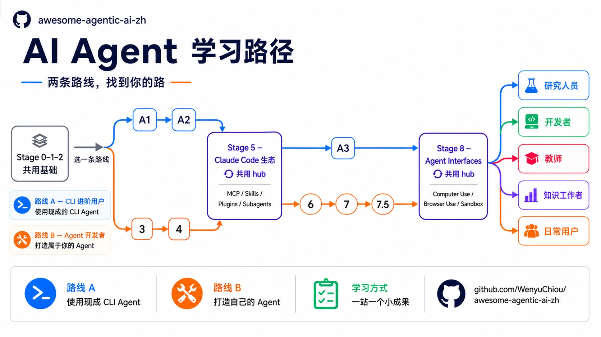
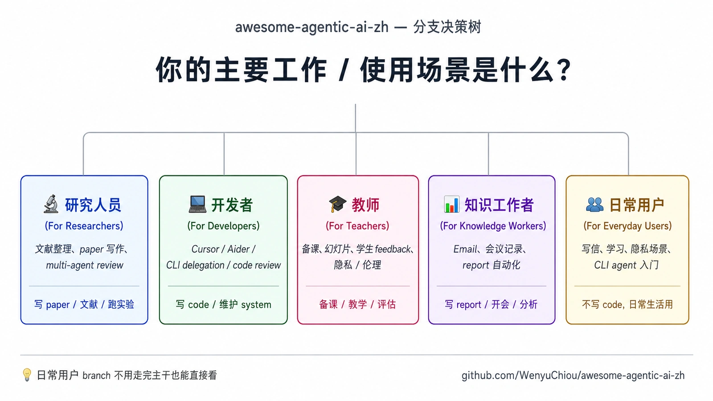

<div align="right">
  <a href="./README.md">繁體中文</a> | <strong>简体中文</strong> | <a href="./README.en.md">English</a>
</div>

<div align="center" markdown="1">



# awesome-agentic-ai-zh

<p><strong>🤖 AI Agent 学习地图 — 从基础 LLM 概念到自己构建多 agent 系统</strong></p>

<p><em><b>学习路线图 + 精选资源 + 可直接运行的小练习</b><br/>8 个主题 Stage，加上 Stage 0 准备关与 Stage 7.5 进阶阅读站；从“LLM 是什么、token 怎么算”走到 multi-agent 编排、Computer Use / Browser Use / Sandbox</em></p>

[](LICENSE)
[](README.md)
[](README.zh-Hans.md)
[](README.en.md)


[](https://wenyuchiou.github.io/awesome-agentic-ai-zh/)

</div>

> 📱 **用手机看的话，建议走[在线文档站](https://wenyuchiou.github.io/awesome-agentic-ai-zh/)而不是这一页。**

---

## 🎯 项目介绍

**本 repo 角色定位**：**学习路线图 + 精选资源 + 可直接运行的小练习**——三件事为核心，帮想学 AI／AI agent 的人从“不知道从哪开始”走到“能设计多 agent 系统”。

具体做法：

| 核心 | 做什么 | 规模 |
|---|---|---|
| **学习路线图** | 把网上散落的高质量项目、教材、必修阅读，按**从零开始、循序渐进**整理成 **8 个主题 Stage + Stage 0 准备关 + Stage 7.5 进阶阅读站**，再分成 2 条学习路线与 5 条延伸路径 | 10 个学习站、2 tracks |
| **资源 curation** | 每阶段精选有官方或 canonical 来源的 project，说明编辑评分、适合谁、教什么、限制与怎么跑；另有按工作找路的 MCP / Skill catalog | 按 Stage 与工作分类 |
| **可直接运行的小练习** | 需要动手的章节会提供可复制的**基础练习**；需要连接模型时保留 Ollama／Anthropic 两条路，并用离线或 mock-based test 检查关键行为 | 按学习成果安排 |

走完这条路线，你会从“**LLM 用户**”进阶到“**agent 系统构建者**”——能看懂 framework 在做什么、能设计多 agent 协作、能写自己的 MCP server。

> 📖 **关于中英文混用**：本项目保留 AI Agent 领域常见英文术语（Prompt Engineering / Context Engineering / Harness / MCP / Skills / RAG 等），因为官方文档、paper、GitHub repo 与 API 文档多以英文为主。每个重要概念会提供 **中文理解名 + 英文正式术语 + 一句白话定位**，让读者能先理解概念，再对接英文生态。完整对照见 [`resources/glossary.zh-Hans.md`](resources/glossary.zh-Hans.md)。

---

## 📋 目录

- [🎯 项目介绍](#-项目介绍)
- [📚 快速开始](#-快速开始)
  - [在线阅读](#在线阅读)
  - [本地下载](#本地下载)
  - [✨ 你会收获什么？](#-你会收获什么)
- [🗺️ 学习地图（两条学习路径）](#-学习地图两条学习路径)
- [💡 如何学习](#-如何学习)
- [📚 相关资源](#-相关资源)
- [🤝 如何贡献](#-如何贡献)
- [🙏 致谢](#-致谢)
- [🎓 引用](#-引用)
- [☕ 支持这个项目](#-支持这个项目)
- [License](#license)

---

## 📚 快速开始

### 🚀 第一次接触 AI agent / 没写过 code？

先看 **[`resources/setup-guide.zh-Hans.md`](resources/setup-guide.zh-Hans.md)** — 先分清 Web、Desktop、IDE、CLI Agent 和 API；只要选一条路，不必把所有工具都装完。

### 在线阅读
- **[学习地图（两条学习路径）](#-学习地图两条学习路径)** — 看完这节决定走 Track A 还 Track B
- **[Stage 0 基础准备](stages/00-foundations.zh-Hans.md)** — 已经会 Python / git / API 的人可以直接跳 Stage 1

### 本地下载
```bash
git clone https://github.com/WenyuChiou/awesome-agentic-ai-zh.git
cd awesome-agentic-ai-zh
# 从 stages/00-foundations.zh-Hans.md 开始
```

### ✨ 你会收获什么？

- 📖 **完全免费** — MIT 授权，所有内容开放共学
- 🗺️ **两条学习路径** — Track A（CLI Power User）教你使用现成的 CLI agent 完成工作；Track B（Agent Builder）教你从代码开始打造自己的 agent。两条路共用 Stage 0–2 基础
- 🛠️ **基础动手练习** — 需要动手的章节都有可直接复制的练习和成功条件；需要连接模型时，再提供 Ollama／Anthropic 两条 SDK 路径。这些练习帮你入门并确认路线；想做更完整的章节型练习，再读各 Stage 链接的 hello-agents／Anthropic Cookbook
- 🎯 **精选 Projects** — 每笔都附编辑评分、适合谁、教什么、限制与怎么跑（含本地 LLM 执行：Ollama、llama.cpp、LocalAI、MLX）
- 🌏 **三语完整维护** — 繁中(canonical)/ 简中 / English,三版皆完整维护、英文非薄翻译
- 🎓 **不只“框架”、还有“Claude Code 生态”** — MCP / Skills / Plugins 完整堆叠
- 🔬 **5 条依用户分流的延伸路线** — 研究员 / 开发者 / 老师 / 知识工作者 / 日常用户
- 🧭 **一站一个小成果** — 先看这一站要做出什么；需要安排时间时，再展开路线图下方的估算

---

## 🗺 学习地图（两条学习路径）


走完 **Stage 0-2（共用基础）** 之后，依你的目的选一条学习路径：

- **Track A — CLI Power User**：你想**用**现成的 CLI agent（Claude Code、Codex、OpenCode、Gemini CLI 等）把工作做顺、效率拉高，不打算自己从零写 agent。3 个 sub-stage（A1-A3）。
- **Track B — Agent Builder**: 你想**从零构建**自己的 agent——学 framework、写 ReAct、设计 multi-agent。Stage 3-8 是主路线。

两条学习路径**不互斥**——多数人是先走 A 把 CLI 用起来，再回到 B 学内部运作；或反过来也行。Stage 5（Claude Code 生态）两条路径都会用到。

### 共用基础（Stage 0-2）

| Stage | 主题 | 关键内容 | 做完会得到什么 |
|---|---|---|---|
| **0** | [基础准备（Foundations）](stages/00-foundations.zh-Hans.md) | Python · CLI · git · API · JSON | 能运行一个小程序，并用 Git 保存成果 |
| **1** | [LLM 基础（LLM Basics）](stages/01-llm-basics.zh-Hans.md) | token · context · API · 模型比较（model comparison）· 本地 LLM | 看懂模型的基本规格，选一个合适的入口 |
| **2** | [Prompt 设计（Prompt Engineering）](stages/02-prompt-engineering.zh-Hans.md) | zero-shot · one-shot · few-shot · system prompt · CoT 边界 | 写出模型看得懂、可以重复测试的 prompt |

### Track A — CLI Power User（想用 CLI 把事情做完）

| Stage | 主题 | 关键内容 | 做完会得到什么 |
|---|---|---|---|
| **A1** | [选一个 CLI Agent，开始用它做事（CLI Agent Intro & Selection）](tracks/cli/A1-cli-intro.zh-Hans.md) | CLI agent 选择 · 安装 · 第一次跑 | 选一个工具，完成第一个真实小任务 |
| **A2** | [建立可重复使用的 CLI 工作流程（CLI Workflow Patterns）](tracks/cli/A2-cli-workflow.zh-Hans.md) | 项目规则 · Skill · 任务拆解 | 把一次成功的做法变成下次也能用的流程 |
| **+5** | [Stage 5 — Claude Code 生态系（Claude Code Ecosystem）](stages/05-claude-code-ecosystem.zh-Hans.md)（**共用 hub**）| MCP · Skills · Plugins · Subagents；Track A 必看 5.1–5.4，选读 5.5–5.8 | 让 CLI agent 读到规则、接上工具并分派工作 |
| **A3** | [把 CLI Agent 接进真实工作流程（Integration & Production）](tracks/cli/A3-cli-production.zh-Hans.md) | MCP 接 CLI · CI 自动化 · cost / observability | 接进真实流程，并看得到它做了什么 |
| **+8** | [Stage 8 — Agent 操作界面（Agent Interfaces）](stages/08-agent-interfaces.zh-Hans.md)（**共用 hub**）| Computer Use · Browser Use · Code Sandbox | 知道任务需要浏览器、电脑操作还是 sandbox |

> **Capstone 门槛**：做到 A3 就能开始 Track A Capstone。Stage 8 是建议的下一站，但不影响 Capstone 入场。

### Track B — Agent Builder（想从零构建 agent）

| Stage | 主题 | 关键内容 | 做完会得到什么 |
|---|---|---|---|
| **3** ⭐ | [工具使用与第一个 Agent Loop](stages/03-tool-use-and-hello-agent.zh-Hans.md) | function calling · ReAct · 6 个动手练习 | 写出会调用工具、看结果再继续的 Agent Loop |
| **4** | [Workflow Graph 与 Agent 框架](stages/04-agent-frameworks.zh-Hans.md) | Workflow Graph · LangGraph · AutoGen · CrewAI · Smolagents | 先画清流程，再选合适的框架实现 |
| **5** ⭐⭐ | [Claude Code 生态系（Claude Code Ecosystem）](stages/05-claude-code-ecosystem.zh-Hans.md)（**共用 hub**、Track A 也学）| MCP · Skills · Plugins · Subagents | 把工具、规则与分工接成可运行系统 |
| **6** | [上下文管理（Context Engineering）：RAG 与 Memory](stages/06-memory-rag.zh-Hans.md) | retrieval · vector DB · 长期记忆（long-term memory）· 情境检索（contextual retrieval）· evaluation | 让 agent 找到证据，也知道什么值得记住 |
| **7** | [Agent Production Engineering：Harness、Loop 与 Graph](stages/07-multi-agent-production.zh-Hans.md) | 进阶 SDK（advanced SDK）· harness · loop · graph · multi-agent · eval · observability | 让系统可以被检查、失败后能恢复 |
| **7.5** | [进阶 Agentic Workflow 概念（Advanced Agentic Concepts）](stages/07.5-advanced-agentic-concepts.zh-Hans.md)（reading map）| 12 个进阶概念 + reading list · 工作边界 · PAR loop · agent-as-judge · graceful degradation | 判断下一个进阶概念是否真的需要加入 |
| **8** ⭐⭐ | [Agent 操作界面（Agent Interfaces）](stages/08-agent-interfaces.zh-Hans.md)（**共用 hub**、Track A 也学）| Computer Use · Browser Use · Code Sandbox | 为任务选择安全、可观察的操作界面 |

<details markdown="1">
<summary>⏱️ 查看时间估算（安排参考，不是截止日期）</summary>

每个人起点不同。先完成一个小成果，再决定是否要多花一周补基础。

- **共用基础**：Stage 0 约 1–2 周；Stage 1 约 1 周；Stage 2 约 1–2 周。
- **Track A**：A1 约 1 周；A2、Stage 5、A3、Stage 8 各约 1–2 周。连同共用基础，整条约 8–10 周。
- **Track B**：Stage 3、4、8 各约 2–3 周；Stage 5 约 3–4 周；Stage 6 约 2 周；Stage 7 约 2–4 周；Stage 7.5 约 1 周阅读。连同共用基础，主干约 16–22 周；每周投入 5–8 小时时，常见是 5–7 个月。

Track A 的操作参考见 [`resources/cli-agents-guide.zh-Hans.md`](resources/cli-agents-guide.zh-Hans.md)。

</details>

> **两个共用 hub（Track A + Track B 都会用到）**：
> - **Stage 5** = Claude Code 生态（MCP / Skills / Plugins / Subagents）—— Track A 学 MCP 接 CLI、Track B 学 agent runtime 结构
> - **Stage 8** = Agent Interfaces（Computer Use / Browser / Sandbox）—— Track A 学“**怎么用**”委派任务、Track B 学“**怎么 build**”embed 进 agent
>
> 两个 hub 出现在两条 track 内、视角不同、学的深度也不同（内文有 Track A / Track B 分视角段）。

> 💡 **想看跨 stage 的完整示例？** [7 步构建你的第一个 AI Agent](walkthroughs/build-first-agent-in-7-steps.zh-Hans.md) — 看同一个 Paper Summary Bot 从 Stage 1 一步步长到 Stage 7，每一步都有可运行程序（**Track B 适用**）

走完主干后，依你的身份挑一条延伸路线继续走。**不确定挑哪条？**



> 💡 **“日常用户”这条路线不必走完主干就能直接读**——是给“想用 AI、但不一定要写 code”的人。

| 路线 | 适合谁 | 主题 |
|---|---|---|
| 🔬 [研究员](branches/for-researcher.zh-Hans.md) | 研究生、博后、PI | 文献整理 · paper 写作 · multi-agent review |
| 💻 [开发者](branches/for-developer.zh-Hans.md) | 软件工程师 | Cursor · Aider · CLI delegation · code review |
| 🎓 [老师](branches/for-teacher.zh-Hans.md) | 老师、讲师 | 备课 · 幻灯片 · 学生 feedback · 隐私 / 伦理 · prompt 范本 |
| 📊 [知识工作者](branches/for-knowledge-worker.zh-Hans.md) | 顾问、PM、分析师 | Email · 会议记录 · report 自动化 |
| 👥 [日常用户](branches/for-everyday-users.zh-Hans.md) | ChatGPT / Claude.ai 用户 | 写信 · 学习 · 隐私场景 · CLI agent 入门 |

---

## 💡 如何学习

这份路线图兼顾概念与实作，目标是带你“从 LLM 用户一路走到 agent 系统构建者”。适合“有基本 Python 能力”的开发者、研究生、自学者。动手之前，先确认你有：

- 基本 Python — 写过 function、用过 API、看得懂 JSON
- 基本 git — clone、commit、push
- 愿意边做边查 — agent 工具变化很快；遇到新名称时，回到官方文档确认即可

上面有缺的就从 Stage 0 补齐；都会了就直接跳 Stage 1。

主干分 5 部分：

- **Part 1（Stage 0-2）：基础与 LLM 入门** — Python / git / API、什么是 LLM、怎么设计 prompt
- **Part 2（Stage 3-4）：构建你的 Agent** — Stage 3 写出第一个 **Agent Loop**；Stage 4 先看懂 **Workflow Graph**，再用 framework 把它做出来
- **Part 3（Stage 5） 共用 hub** — Claude Code 生态系（MCP / Skills / Plugins / Subagents、Track A + B 都会用到）
- **Part 4（Stage 6-7）：进阶集成** — Stage 6 用 RAG / memory 深入 **Context Engineering**；Stage 7 让 loop / graph 在 production 稳定运行
- **Part 5（Stage 8） 共用 hub** — Agent Interfaces（Computer Use / Browser Use / Code Sandbox、两条 track 都会用到）

> 🔭 **学习顺序和五个控制问题回答不同事情**：学习时先在 Stage 2 写好 **Prompt**，Stage 3 写出 **Agent Loop**，Stage 4 先看懂 **Workflow Graph**，再用 framework 把它做出来；Stage 5 学会用 MCP、Skills、Plugins 和 Subagents 接上工具与规则，Stage 6 再深入 **Context Engineering**，Stage 7 最后把 Harness、Loop 和 Graph 做到能长时间稳定运行。`prompt → context → harness → loop → graph` 是五个检查问题，不是严格的软件层或章节编号；Harness 可以包含 Loop，Graph 也可以连接 Harness、固定程序和人工批准。完整定义见 [Stage 7 五个控制问题](stages/07-multi-agent-production.zh-Hans.md#五个控制问题prompt--context--harness--loop--graph)，Prompt 与 Context 的边界见 [Stage 2](stages/02-prompt-engineering.zh-Hans.md)。

走完主干后，依你的身份挑一条延伸路线继续走。

最重要的说一句话：**不要跳过动手练习**。每个 stage 的动手练习都是“不动手就学不会”的东西，光读过去后面会卡住。

> 🎓 **动手练习怎么用才对**：`starter.py` 是可直接复制与运行的起点。先跑一次，接着只改一件小事，再跑测试看结果是否按你的想法改变；不用先抄空白文件，也不用把整份答案重写一遍。完整方法与卡住时的处理流程见 [`docs/HOW_TO_USE.md`](docs/HOW_TO_USE.md)。

准备好了吗？[从 Stage 0 开始](stages/00-foundations.zh-Hans.md)。

---

## 📚 相关资源

完整的相关资源（用语说明 + 常用 MCP / Skill highlight + awesome lists + 中文社群）抽到 **[RESOURCES.zh-Hans.md](RESOURCES.zh-Hans.md)** 避免主页过长。

直接看常用入口、依**情境**分组：

### 🚀 入门 / 环境设定

| 你的状况 | 去哪 | 内容 |
|---|---|---|
| 完全没写过 code、第一次接触 AI agent | [`resources/setup-guide.zh-Hans.md`](resources/setup-guide.zh-Hans.md) | 先选 Web、Desktop、IDE、CLI Agent 或 API；不必全装 |
| 不知道工具种类或 LLM Provider 怎么区分 | [`resources/setup-guide.zh-Hans.md`](resources/setup-guide.zh-Hans.md) | 先分清工具身份，再看官方 Cloud API 与本地 Runtime 入口 |
| 同主题 awesome list / 中文社群 | [`RESOURCES.zh-Hans.md` 同主题清单](RESOURCES.zh-Hans.md#同主题的清单型-awesome-lists) | 5-10 分钟逛一轮 |

### 📖 概念 / 用语

| 你的状况 | 去哪 | 内容 |
|---|---|---|
| 不懂某个词（LLM / agent / RAG / token / MCP / Skill / 向量数据库…） | [`resources/glossary.zh-Hans.md`](resources/glossary.zh-Hans.md) | 30+ 词、每个 30-80 字 + 哪 stage 讲细的 |
| 想搞懂 agent 为什么有的在 terminal、有的在 Telegram、有的在 Jetson | [`resources/agent-paradigms.zh-Hans.md`](resources/agent-paradigms.zh-Hans.md) | 5 种 agent 型态 mental model + Hermes / OpenClaw 例子 |
| MCP / Skills / Plugins 用语对照 | [`RESOURCES.zh-Hans.md` 三个核心用语](RESOURCES.zh-Hans.md#三个核心用语mcp--skills--plugins) | 1 页速查表 |
| 想找 AI Agent 课程、作品路线或证书 | [`resources/courses.zh-Hans.md`](resources/courses.zh-Hans.md) | 12 条现行课程与学习路线，按目标分组；分清完成证书、技能徽章和认证考试，并把作品证据放在前面 |

### 🛠 动手实作

| 你的状况 | 去哪 | 内容 |
|---|---|---|
| 想动手写 Skill / MCP server / 接 Word / Zotero / 本机 LLM | [`resources/cookbook.zh-Hans.md`](resources/cookbook.zh-Hans.md) | 6 个 step-by-step recipe、每个 30-50 分钟 |
| 想用 subagent 但不知道该派谁、怎么派、派什么工作 | [`resources/subagent-cookbook.zh-Hans.md`](resources/subagent-cookbook.zh-Hans.md) | 15 个复制粘贴即用的 dispatch recipe |
| 自己写 subagent / 组合多个 / debug 跑坏的（进阶）| [`resources/subagent-advanced.zh-Hans.md`](resources/subagent-advanced.zh-Hans.md) | description 写法 4 个 bug + composition 3 pattern + debug 5 切点 |
| 卡在 tool calling（LLM 不调用 / schema 写不好 / ReAct loop 跑不停） | [`examples/stage-5/tool-calling-tutor/`](examples/stage-5/tool-calling-tutor/) | 可装进 Claude Code 的 skill、4-symptom diagnostic |
| 动手练习怎么正确使用（主动 vs 被动模式） | [`docs/HOW_TO_USE.md`](docs/HOW_TO_USE.md) | 5-10 分钟读完、配合每个 stage 用 |

### 🔌 接日常工具 / 找 MCP server

| 你的状况 | 去哪 | 规模 |
|---|---|---|
| 接 Notion / Obsidian / Excel / GitHub 等工具 | [`RESOURCES.zh-Hans.md` 接日常工具](RESOURCES.zh-Hans.md#接日常工具常用-mcp-server--skill) | 可见的安全起点与有编辑评分的精选资源 |
| 完整 MCP server / Skill 目录（含星等、分类） | [`resources/mcp-skills-catalog.zh-Hans.md`](resources/mcp-skills-catalog.zh-Hans.md) | 按工作分类；每笔标示用途、状态与限制 |

### 🔬 研究 / production 级

| 你的状况 | 去哪 | 内容 |
|---|---|---|
| 研究 workflow + multi-LLM delegation skill | [`RESOURCES.zh-Hans.md` 研究工作流](RESOURCES.zh-Hans.md#研究工作流本-repo-维护者出品) | 本 repo 维护者出品的 Claude Code 研究 skill 对 |
| CLI agent 身份与选择指南 | [`resources/cli-agents-guide.zh-Hans.md`](resources/cli-agents-guide.zh-Hans.md) | Track A 的核心参考 |
| Schema 设计规则（tool calling 必看） | [`resources/schema-design-cheatsheet.zh-Hans.md`](resources/schema-design-cheatsheet.zh-Hans.md) | 5 条黄金规则 + 5 个 anti-pattern |

---

## 🤝 如何贡献

这个 repo 是一个 AI 学习文档，如果你也有收集很好的资源，也欢迎贡献：

- 🐛 **汇报 Bug** — 内容错误、链接失效、过时信息 → 开 Issue
- 💡 **提建议** — 缺什么 stage、该加哪个 project → 开 Issue 讨论
- 📝 **完善内容** — 改进现有 stage 内容、修 typo → 直接 PR
- ✍️ **新增 project** — 在某个 stage 加 1-3 个 project，并附上“为什么这个 project 适合放这个 stage”的说明
- 🌏 **翻译** — 补英文 companion 没翻到的段落，或翻成其他语言
- 🌱 **担任 Stage / Branch maintainer** — 长期 review 特定领域，详见 [CONTRIBUTORS.md](CONTRIBUTORS.md)。

PR 流程跟 style 规范请看 [CONTRIBUTING.zh-Hans.md](CONTRIBUTING.zh-Hans.md) 和 [resources/style-guide.zh-Hans.md](resources/style-guide.zh-Hans.md)。

> 🤖 **Project 链接有两层自动检查** — maintainer branch 新增 repo 时，留言 bot 会贴出 stars、license、归档状态与最后更新；这一层只提供信息。另一个 read-only freshness gate 会在所有 PR（包括 fork）检查本次碰到的 repo entry，只有 404／搬家后仍用旧链接／归档却写成当前可用／明确 license 冲突等硬矛盾会阻挡；仅仅半年没有更新只会提醒，收不收仍由 maintainer 决定。

> 📅 **想看最近 ship 了什么** → [`CHANGELOG.md`](CHANGELOG.md)（最近 14 天）。
> Maintainer 内部进度与 launch checklist 放在 [.github/launch-checklist.md](.github/launch-checklist.md)（内部文件）。

---

## 💬 顾问 / 联系

公开学习版（MIT），欢迎自由取用。

目前以顾问为主：团队或公司若需 **prompt review / audit** 或 **AI agent workflow 咨询**，欢迎来信（博士生、时间有限）：📧 [wenyuchiou12@gmail.com](mailto:wenyuchiou12@gmail.com)

---

## 🙏 致谢

### Inspiration

- [**Datawhale Hello-Agents**](https://github.com/datawhalechina/hello-agents) — 中文圈最完整的 chapter-length agent 教材，本 repo 的“章节 + 进度”结构受这份启发；每个 stage / 练习 folder 都有 📚 callout 点过去深度章节。特别感谢。
- [**Datawhale 社群**](https://github.com/datawhalechina) — 中文 ML 共学社群的标杆，本 repo 多个 anchor project 来自这里
- [**liyupi/ai-guide**](https://github.com/liyupi/ai-guide) — 中文圈最大"AI 资源大全" + Vibe Coding 教学（涵盖 Agent Skills / RAG / MCP / A2A / Harness Engineering）。本 repo 是"结构化路线"、ai-guide 是"广度资源库"，互为补充

### 其他相关项目

同主题、不同切入角度的清单，搜资源时可以一起用：

- [`wong2/awesome-mcp-servers`](https://github.com/wong2/awesome-mcp-servers) — MCP server 清单，按分类整理
- [`punkpeye/awesome-mcp-servers`](https://github.com/punkpeye/awesome-mcp-servers) — 另一份 MCP server 清单
- [`hesreallyhim/awesome-claude-code`](https://github.com/hesreallyhim/awesome-claude-code) — Claude Code 相关工具与 plugin 清单（整理中）
- [`travisvn/awesome-claude-skills`](https://github.com/travisvn/awesome-claude-skills) — Claude Skills 清单
- [`anthropics/claude-plugins-official`](https://github.com/anthropics/claude-plugins-official) — Anthropic 官方 plugin 模板，要打包自己的 plugin 从这份开始

这些是纯清单形式（看到再挑），本 repo 的不同点是有“从 Stage 0 一路走到 production 的学习顺序”。

### 贡献者

[](https://github.com/WenyuChiou/awesome-agentic-ai-zh/graphs/contributors)

新贡献者会自动出现在上方。完整列表 → [GitHub Contributors](https://github.com/WenyuChiou/awesome-agentic-ai-zh/graphs/contributors)。

### 个人

- [@WenyuChiou](https://github.com/WenyuChiou) — Maintainer

---

## 🎓 引用

如果这个学习地图对你的学习或工作有帮助，欢迎引用：

```bibtex
@misc{awesome_agentic_ai_zh_2026,
  title = {awesome-agentic-ai-zh: A Structured Learning Roadmap for Agentic AI},
  author = {Chiou, Wenyu},
  year = {2026},
  url = {https://github.com/WenyuChiou/awesome-agentic-ai-zh},
  note = {10-stop learning path: 8 topic stages plus Stage 0 readiness and the Stage 7.5 reading stop, ending at Agent Interfaces (Computer Use / Browser Use / Code Sandbox), with curated projects + hello-X demos. Trilingual (zh-TW / 简中 / English).}
}
```

---

## ☕ 支持这个项目

这份学习地图是免费、开源（MIT）。如果它对你有帮助，除了给个 ⭐ Star，也欢迎请作者喝杯咖啡、支持它持续更新：

<a href="https://www.buymeacoffee.com/wenyuchiou" target="_blank" rel="noopener noreferrer"></a>

或直接点 repo 右上角的 **❤ Sponsor** 按钮。（GitHub Sponsors 审核中，通过后会一并加上。）

---

## License

MIT。Maintained by [@WenyuChiou](https://github.com/WenyuChiou)。

<div align="center">
  <p>⭐ 如果这个 repo 对你有帮助，欢迎给个 Star — 这对作者继续更新是很大的鼓励</p>
</div>
