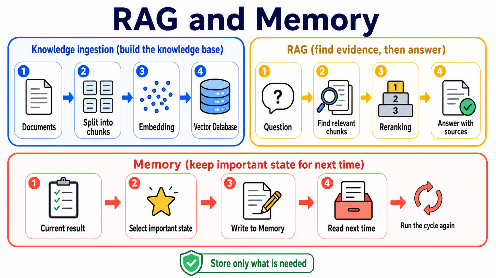

# Stage 6 — RAG and Memory: find the source first, then remember what matters

> [繁體中文](./06-memory-rag.md) | [简体中文](./06-memory-rag.zh-Hans.md) | **English**

<!-- freshness: canonical=stages/06-memory-rag.md; verified_on=2026-08-28; scope=rag,retrieval,embeddings,vector-stores,memory,evaluation,project-status; max_age_days=90 -->

Models do not know everything. **RAG** is like asking a model to consult a book before it answers; **Memory** is like giving it a notebook for things it will need next time. This stage distinguishes the two, then helps you build both step by step.

<a id="the-two-context-capabilities-an-agent-needs"></a>
<a id="-what-is-context-engineering-positioning"></a>
<a id="where-it-sits-in-the-five-layer-stack"></a>
<a id="this-stage-covers-2-of-the-4-sub-problems-lance-martin-2025-framing"></a>
<a id="four-concepts-commonly-mixed-up"></a>
<a id="rag-vs-long-context-vs-fine-tuning--when-to-use-what"></a>
<a id="-learning-objectives"></a>
<a id="-prerequisites"></a>
<a id="-unit-guide-progressive-flow"></a>
<a id="-adaptive--agentic-rag--self-rag--crag--adaptive-rag-2024-focus"></a>
<a id="3-design-patterns-when-to-use-what--essential-for-track-b"></a>
<a id="-want-to-implement--dive-deeper"></a>
## 📌 Learning goals

By the end of this stage, you can:

1. State the difference between RAG and Memory in one sentence.
2. Explain how data becomes **chunks** and **embeddings**, then gets retrieved.
3. Build a minimal RAG pipeline whose answers include sources.
4. Know what data is worth remembering and what should not be stored.
5. Compare two approaches with a small test instead of relying on “it feels better.”

## 🧩 Meet seven core terms first

| Core term | Like | What it means |
|---|---|---|
| **Retrieval** | Finding a few pages on a shelf that may answer the question | After receiving a question, find relevant content in external data. |
| **RAG (Retrieval-Augmented Generation)** | Consult a book first, then answer in your own words | Retrieve first, then give the retrieved content to the model to generate an answer. |
| **Embedding** | Making a coordinate card for a sentence’s meaning | Turn text into a sequence of numbers so text with similar meaning is close in vector space. |
| **Vector Store / Vector Database** | A drawer that finds cards by meaning | Store embeddings and retrieve related data by similarity; storage and operational capabilities vary by product. |
| **Chunk** | Cutting a big book into small cards you can pick up | Split long documents into smaller pieces for search and inclusion in context. |
| **Reranking** | Reordering the cards found the first time | Use a second method to rescore candidates so the pieces most likely to help come first. |
| **Memory** | The assistant’s own notebook | Write down state still needed across messages or sessions, then read it back later; it is not another name for chat history. |



### Choose the right method with one table

| Problem | Consider first | Why |
|---|---|---|
| The data is short and only needed for this answer | **Long context** | Put the data directly in this request; it is the shortest path. |
| There are many documents, and you only know which passages to find when a question arrives | **RAG** | Find relevant pieces first instead of sending every document each time. |
| The assistant must remember preferences, task state, or past results next time | **Memory** | Write information worth keeping to a storage layer that can be read again. |
| You want to change model behavior or a specific capability consistently | **Fine-tuning** | Adjust model behavior; it does not automatically provide current documents. |

No option is always best. Evaluate with your own data, questions, and success criteria.

## 🚪 Entry requirements and reading paths

- **Learning for the first time:** Read the seven core terms, complete Exercises 1–4, then do the short self-check.
- **Building a long-term assistant:** Complete Exercise 5 next, then open the Memory design section.
- **Researching or shipping:** Finally open the advanced RAG, chunking, evaluation, and research entry points.

<details markdown="1">
<summary>Time, environment, cost, and data safety</summary>

- Plan to complete this in two or three sessions; start each session with one exercise you can run.
- You need Python, Git, and a terminal. Follow each exercise README for installation.
- Path A uses an OpenAI-compatible example; Path B uses the Anthropic path. Model and embedding calls may incur costs.
- Start with small documents. Do not send passwords, tokens, medical data, or unauthorized company documents to external services.
- Keep API keys in environment variables, not in code or commits.

</details>

## 📚 Required reading

First see how the parts of RAG fit together, then start the first exercise.

<details markdown="1">
<summary>Reading order and official entry points</summary>

1. [LangChain Retrieval](https://docs.langchain.com/oss/python/langchain/retrieval) — See how loaders, splitters, embeddings, vector stores, and retrievers work together.
2. [LlamaIndex concepts](https://developers.llamaindex.ai/python/framework/getting_started/concepts/) — Understand indexing and querying through a document-oriented approach.
3. [Chroma getting started](https://docs.trychroma.com/docs/overview/getting-started) — See the minimal way to use a local vector database.
4. [LangGraph Agentic RAG](https://docs.langchain.com/oss/python/langgraph/agentic-rag) — After basic RAG, see how an agent decides whether to retrieve data.

</details>

<a id="-hands-on-exercises-illustrative-basics"></a>
## 🛠 Hands-on exercises

Every exercise already has a starter. Copy and run the commands directly; you do not need to write a blank solution first.

<a id="exercise-1-embeddings"></a>
### Exercise 1: Turn two sentences into embeddings

**Result:** You will see that two sentences with similar meanings are closer than an unrelated sentence.

```powershell
cd examples/stage-6/01-embeddings
python starter.py
python starter_anthropic.py
```

[Open the full instructions and checks](../examples/stage-6/01-embeddings/README.en.md). Start with very few sentences to avoid unnecessary API costs.

<a id="exercise-2-vector-db"></a>
### Exercise 2: Put embeddings in a vector database

**Result:** You can put text into Chroma, then retrieve relevant pieces with a question.

```powershell
cd examples/stage-6/02-vector-db
python starter.py
python starter_anthropic.py
```

[Open the full instructions and checks](../examples/stage-6/02-vector-db/README.en.md). Practice data must not include secrets or personal data.

<a id="exercise-3-chunking-comparison"></a>
### Exercise 3: Compare three chunking methods

**Result:** You will see what happens when chunks are too large, too small, or overlap too much.

```powershell
cd examples/stage-6/03-chunking-comparison
python starter.py
python starter_anthropic.py
```

[Open the full instructions and checks](../examples/stage-6/03-chunking-comparison/README.en.md). Do not memorize a “standard size” first; inspect document structure and test results.

<a id="exercise-4-full-rag-pipeline"></a>
### Exercise 4: Connect a complete RAG pipeline

**Result:** The program retrieves data first, then answers and shows the source pieces it used.

```powershell
cd examples/stage-6/04-full-rag-pipeline
python starter.py
python starter_anthropic.py
```

[Open the full instructions and checks](../examples/stage-6/04-full-rag-pipeline/README.en.md). Start with a small dataset; do not confuse “the code runs” with “the answer is correct.”

<a id="exercise-5-long-term-memory"></a>
### Exercise 5: Remember a preference

**Result:** This exercise only adds, searches, and reads one preference while the program is running; temporary storage is not long-term persistence.

```powershell
cd examples/stage-6/05-long-term-memory
python starter.py
python starter_anthropic.py
```

[Open the full instructions and checks](../examples/stage-6/05-long-term-memory/README.en.md). Store only what the task requires, and provide ways to view, edit, and delete it.

### Recommended mini-project: an assistant that retrieves and remembers

Choose three to five small documents you are authorized to use. Have the assistant list sources when it answers questions, then remember only one non-sensitive preference, such as “give the short version first.” Success means it says it does not know when evidence is missing, reads the preference after restart, and lets you delete that memory.

<details markdown="1">
<summary>Basic RAG pipeline: how data goes in and answers come out</summary>

## 🌐 Basic RAG pipeline

RAG has two paths: one prepares the data first, and the other finds data when a question arrives.

| Stage | What it does | A simple analogy |
|---|---|---|
| Load | Read content from PDFs, web pages, or databases | Move books onto the table |
| Split | Divide it into chunks | Divide a book into small cards |
| Embed | Turn each card into a vector | Give meanings coordinates |
| Store | Save vectors and source metadata | Put labeled cards into a drawer |
| Retrieve | Find candidate chunks for the question | Take out cards that may contain the answer |
| Rerank (optional) | Reorder candidate content | Check again which card is most useful |
| Generate | Give the model the question and evidence | Answer while looking at the cards |
| Cite / Evaluate | Show sources and check results | Tell others where the answer came from |

A **retriever** is an interface that receives a question and returns relevant documents. It does not have to use a vector database; BM25, SQL, web search, and hybrid search can also be retrievers.

</details>

<details markdown="1">
<summary>Advanced RAG terms: add them only when the problem calls for them</summary>

<a id="-advanced-rag-techniques-read-after-basic-rag"></a>
<a id="-overview-of-advanced-rag-techniques--2025-2026-main-themes-"></a>
## 🚀 Advanced RAG techniques (after you have run basic RAG)

Build a baseline first, then add only one component at a time. Otherwise, even if the score improves, you will not know which step caused it.

<a id="-graphrag--knowledge-graph--rag"></a>
### 🔗 GraphRAG — knowledge graphs + RAG

**GraphRAG** first identifies entities (people, places, products, and so on) and relationships, then uses graph connections to help queries across documents or across a whole topic. It has extra indexing costs and is not needed for every small question-answering task.

- [Microsoft GraphRAG](https://github.com/microsoft/graphrag) — an MIT-licensed research reference implementation. The project is currently marked as maintenance mode; it is suitable for studying methods and maintaining existing deployments, not for describing as a rapidly evolving general product.
- [GraphRAG paper](https://arxiv.org/abs/2404.16130) — the original method and query-focused summarization.
- [LightRAG](https://github.com/HKUDS/LightRAG) — another active graph-based RAG implementation; its architecture and data model differ from Microsoft GraphRAG.

<a id="-contextual-retrieval--anthropics-prompt-caching-solution"></a>
### 🪶 Contextual Retrieval — add document context to each chunk first

**Contextual Retrieval** adds each chunk’s context within the full document during indexing, before embedding and BM25. In Anthropic’s experiment, contextual embeddings, contextual BM25, and reranking reduced the top-20 chunk retrieval failure rate in its tests from 5.7% to 1.9%. This is a result for a particular dataset and setup, not a guarantee for all RAG systems.

- [Anthropic Contextual Retrieval](https://www.anthropic.com/engineering/contextual-retrieval)
- [Anthropic cookbook](https://platform.claude.com/cookbook/capabilities-contextual-embeddings-guide)

<a id="-hybrid-search--reranking--two-common-reinforcement-components-for-production-rag"></a>
<a id="-recommended-tools-for-common-memory--rag-use-cases-categorized-by-purpose"></a>
## 🎯 Hybrid Search and Reranking

**BM25** is good at finding exact or near-exact words; vector search is good at finding sentences with similar meaning. **Hybrid Search** combines candidates from both; **Reranking** then examines each question-candidate pairing and moves more useful pieces to the top.

Start with [Qdrant hybrid queries](https://qdrant.tech/documentation/concepts/hybrid-queries/), [Weaviate hybrid search](https://docs.weaviate.io/weaviate/search/hybrid), or PostgreSQL full-text search + [pgvector](https://github.com/pgvector/pgvector). Measure quality and latency with your own query set.

<a id="query-transformations--hyde--multi-query--rag-fusion"></a>
### Query Transformations — HyDE, Multi-Query, and RAG Fusion

- **HyDE:** Generate a hypothetical answer first, then use it to retrieve data. It helps when a user question is too short, but the hypothetical answer can also steer retrieval off course.
- **Multi-Query:** Rewrite the same question from several angles, search each version, then combine the results.
- **RAG Fusion:** Apply rank fusion to results from multiple queries, reducing the risk of depending on a single query phrasing.

### 🔁 Self-RAG, CRAG, Adaptive RAG, and Agentic RAG

- **Self-RAG:** The model learns to decide when to retrieve and to reflect on evidence and answers.
- **CRAG (Corrective RAG):** First judge whether retrieved content is good enough; if it is not, revise the query or source.
- **Adaptive RAG:** Choose different retrieval flows based on question difficulty.
- **Agentic RAG:** Make retrieval a tool so an agent decides when and how to use it. More freedom also brings more latency, cost, and debugging difficulty.

Original entry points: [Self-RAG](https://arxiv.org/abs/2310.11511), [CRAG](https://arxiv.org/abs/2401.15884), [Adaptive-RAG](https://arxiv.org/abs/2403.14403), and the [LangGraph Agentic RAG tutorial](https://docs.langchain.com/oss/python/langgraph/agentic-rag).

<a id="-raptor--hierarchical-recursive-retrieval-iclr-2024"></a>
### 🌳 RAPTOR — use a summary tree to find content at different levels

**RAPTOR** repeatedly clusters and summarizes text, forming a tree from fine to coarse. Detail questions can retrieve leaf nodes, while topic questions can retrieve higher-level summaries. It differs from GraphRAG, which builds a graph from entity relationships. [RAPTOR paper](https://arxiv.org/abs/2401.18059).

<a id="-dspy--programmatic-optimization-without-prompting-path-3-paradigm"></a>
### 🧬 DSPy — use data and metrics to optimize LLM programs

**DSPy** combines prompts and modules into an optimizable program, then uses examples and a metric to search for better settings. It does not mean you no longer need to describe the task, and it will not automatically fix bad data. [stanfordnlp/dspy](https://github.com/stanfordnlp/dspy).

</details>

<details markdown="1">
<summary>Memory design: what to remember, when to write, and when to forget</summary>

<a id="stage-6--context-engineering-rag-and-memory"></a>
<a id="separate-the-terms-first-retrieval--rag--vector-store--memory-are-not-the-same-thing"></a>
<a id="-from-rag-to-memory--why-rag-isnt-enough"></a>
<a id="-5-mainstream-memory-layers-that-can-ship-choose-by-use-case"></a>
<a id="2024-2026-latest-memory-works--3-main-themes"></a>
## 🌉 From RAG to Memory — why RAG is not enough

RAG usually finds information in external knowledge; Memory saves state an agent will need later. A product manual belongs in a knowledge base, while a preference a user has allowed you to save belongs in memory. Do not permanently store whole conversations without selection.

## 🧠 What Memory is and how to design it

When you design Memory, answer four questions first: **what to write, when to write, how to find it, and when to change or delete it**.

### Working memory vs. long-term memory — two time scales

- **Working memory:** Short-term state used by the current task, such as the step you are currently on.
- **Long-term memory:** Information still needed across sessions, such as a preference saved with the user’s consent.

### Episodic / Semantic / Procedural memory — three content types

- **Episodic memory:** What happened, such as the reason the last deployment failed.
- **Semantic memory:** More stable facts, such as a project using Python 3.13.
- **Procedural memory:** How to do something, such as the checks before a release.

### Three design patterns (when to use which) ⭐ Track B essential

1. **Direct state table:** Clear fields that are easy to inspect and delete. Start here.
2. **Searchable text memory:** Content is more flexible; preserve the source, time, and owner when writing it.
3. **Temporal knowledge graph:** Consider it only when relationships change and you must track “when it was valid”; its cost and governance are the most complex.

### ⭐ How to choose among current Memory projects

- [Mem0](https://github.com/mem0ai/mem0): Apache-2.0; available as a self-hostable library/server and as a managed service. Good for practicing the memory lifecycle of add, search, update, and delete.
- [Letta Code](https://github.com/letta-ai/letta-code): Letta’s current development entry point, emphasizing stateful agents and memory. The older `letta-ai/letta` V1 server is historical reference only.
- [Graphiti](https://github.com/getzep/graphiti): An Apache-2.0 temporal context graph engine, useful for studying relationships that change over time.
- [LangMem](https://github.com/langchain-ai/langmem): MIT-licensed and integrated with LangGraph store; suitable for projects that already use LangGraph.
- [Zep](https://github.com/getzep/zep): The current product centers on Zep Cloud and examples/integrations; Community Edition is deprecated and moved to `legacy/`.

### Advanced: CoALA framework — a four-layer taxonomy for agent memory

**CoALA** divides language-agent memory into working, episodic, semantic, procedural, and related parts, and considers how memory is written, retrieved, and updated. It is an analytical framework, not a database you must install. [CoALA paper](https://arxiv.org/abs/2309.02427).

<a id="advanced-generative-agents--triple-score-weighting-classic-case-study"></a>
### Advanced: Generative Agents — three-score retrieval (a classic case)

Generative Agents selects memories to retrieve by recency, importance, and relevance, then uses reflection to produce higher-level summaries. This is a research design; it does not mean every production system uses the same formula. [Generative Agents paper](https://arxiv.org/abs/2304.03442).

</details>

<details markdown="1">
<summary>Chunking, Reflexion, and evaluation: how to know whether it really improved</summary>

## 🧩 Chunking details (technical deep dive)

When a chunk is too large, one card mixes too many topics; when it is too small, the context needed for an answer can be split apart. Start with the document’s own headings and paragraphs, then adjust using tests.

Common methods:

- **Fixed-size:** Easy to reproduce, but may split in the middle of a sentence.
- **Recursive / structure-aware:** Split first by headings, paragraphs, and sentences; it usually fits document structure better.
- **Sentence window:** Search with small sentences, then include surrounding context during retrieval.
- **Parent-child / small-to-big:** Small chunks handle search, while a larger parent handles answering.
- **Semantic chunking:** Split at changes in meaning; it needs more computation and more careful evaluation.

For each chunk, preserve at least its source document, location or page number, version, and access permission. More overlap is not always better; it increases index size and duplicate content.

## 🪞 Advanced: full Reflexion with persistent memory ⭐ Track B elective

**Reflexion** has an agent write feedback after an attempt, then read it on the next attempt. To become true persistent memory, the feedback must be stored in a layer that remains after the process ends and can be viewed, edited, and deleted. [Reflexion paper](https://arxiv.org/abs/2303.11366).

### 📚 If you want to build or go deeper

- Write one short reflection for a failed case, then rerun the same question.
- Compare whether “without reflection” and “with reflection” improve a clear success criterion.
- Do not store model guesses, secrets, or user data without an end date.

<a id="-advanced-reasoning--reflection--2024-2026-trends--covers-both-tracks"></a>
<a id="path-1-prompt-based-reflection--reasoning-traditional-approach"></a>
<a id="path-2-trained-in-reasoning--reflection-major-shift-in-2024-2026"></a>
<a id="how-to-choose-between-the-two-paths"></a>
## 🤔 Advanced Reasoning / Reflection — two paths

- **Prompt-based reflection:** Use a prompt after execution to check errors and produce improvement suggestions. It is easy to experiment with, but it may repeat the same errors.
- **Trained-in reasoning:** A model learns stronger reasoning behavior during training. Users must still check answers and evidence; hidden reasoning is not a reliable source.

<a id="-rag--memory-eval--running-is-not-running-accurately"></a>
## 📏 RAG / Memory evaluation — runnable does not mean accurate

Measure at least three things separately:

1. **Retrieval:** Was the correct evidence retrieved?
2. **Answer:** Is the answer supported by evidence, and does it actually answer the question?
3. **Memory:** Can information that should be remembered be read back, and is information that should not be remembered rejected or deleted?

Build a small set of human-checked questions, answers, and sources. Record results before and after every change; do not look only at one overall score.

- [Ragas](https://github.com/vibrantlabsai/ragas) — an Apache-2.0 toolkit for evaluating LLM applications; Vibrant Labs is the current canonical owner.
- [TruLens](https://github.com/truera/trulens) — an evaluation and observability tool.
- [LangSmith evaluation](https://docs.langchain.com/langsmith/evaluation) — LangChain’s managed evaluation and tracing service.

</details>

<a id="-featured-projects-templates--specs--example-collections"></a>
<a id="-what-is-memory--how-to-design-it"></a>
<a id="advanced-coala-framework--a-4-layer-taxonomy-for-agent-memory"></a>
<a id="-advanced-full-reflexion-with-persistent-memory--track-b-elective"></a>

## 🎯 Curated projects and learning resources

Start with **LlamaIndex or LangChain + Chroma** to understand the minimal pipeline; prefer pgvector when you already use PostgreSQL. Do not install the whole table at once.

<details markdown="1">
<summary>18 checked entry points, editorial ratings, and limitations</summary>

<small>Fact check: 2026-08-28 UTC</small>

<table>
  <thead>
    <tr><th scope="col">Category</th><th scope="col">Project</th><th scope="col">Editorial rating</th><th scope="col">Best for</th><th scope="col">What you learn</th><th scope="col">Status / limits</th></tr>
  </thead>
  <tbody>
    <tr><th scope="rowgroup" rowspan="4">RAG framework</th><td><a href="https://github.com/run-llama/llama_index">LlamaIndex</a></td><td>⭐⭐⭐⭐⭐</td><td>Beginners building document-based applications</td><td>Indexes, retrievers, query engines</td><td>MIT; many packages, so start with the official starter</td></tr>
    <tr><td><a href="https://github.com/infiniflow/ragflow">RAGFlow</a></td><td>⭐⭐⭐⭐⭐</td><td>Teams that want to inspect a complete web product</td><td>Document parsing, hybrid retrieval, UI</td><td>Apache-2.0; deployment is heavier than a teaching example</td></tr>
    <tr><td><a href="https://github.com/HKUDS/LightRAG">LightRAG</a></td><td>⭐⭐⭐⭐</td><td>Readers studying graph-based RAG</td><td>Graph + vector retrieval</td><td>MIT; research-oriented and not equivalent to Microsoft GraphRAG</td></tr>
    <tr><td><a href="https://github.com/deepset-ai/haystack">Haystack</a></td><td>⭐⭐⭐⭐</td><td>Those comparing another pipeline framework</td><td>Components, pipelines, evaluation</td><td>Apache-2.0; choose one framework to practice first</td></tr>
  </tbody>
  <tbody>
    <tr><th scope="rowgroup" rowspan="5">Vector data</th><td><a href="https://github.com/chroma-core/chroma">Chroma</a></td><td>⭐⭐⭐⭐⭐</td><td>First local vector-search project</td><td>Collections, add, query</td><td>Apache-2.0; practice and production setups differ</td></tr>
    <tr><td><a href="https://github.com/qdrant/qdrant">Qdrant</a></td><td>⭐⭐⭐⭐⭐</td><td>Teams needing self-hosted or managed service</td><td>Dense, sparse, hybrid queries</td><td>Apache-2.0; plan service operations and backups</td></tr>
    <tr><td><a href="https://github.com/weaviate/weaviate">Weaviate</a></td><td>⭐⭐⭐⭐</td><td>Projects needing schemas and hybrid search</td><td>BM25 + vector search</td><td>BSD-3-Clause; feature-rich, so begin with a small baseline</td></tr>
    <tr><td><a href="https://github.com/pgvector/pgvector">pgvector</a></td><td>⭐⭐⭐⭐</td><td>Teams already using PostgreSQL</td><td>SQL and vectors in one database</td><td>PostgreSQL extension; still needs indexing and query tuning</td></tr>
    <tr><td><a href="https://github.com/lancedb/lancedb">LanceDB</a></td><td>⭐⭐⭐⭐</td><td>Developers putting vector data into an app</td><td>Embedded/serverless vector workflows</td><td>Apache-2.0; verify capabilities for the deployment mode</td></tr>
  </tbody>
  <tbody>
    <tr><th scope="rowgroup" rowspan="4">Agent memory</th><td><a href="https://github.com/mem0ai/mem0">Mem0</a></td><td>⭐⭐⭐⭐⭐</td><td>Cross-session preference memory</td><td>Add, search, update, delete</td><td>Apache-2.0; assess OSS and managed platforms separately</td></tr>
    <tr><td><a href="https://github.com/letta-ai/letta-code">Letta Code</a></td><td>⭐⭐⭐⭐</td><td>Studying stateful agents</td><td>Memory-first agent runtime</td><td>Apache-2.0; the old Letta V1 server is retired</td></tr>
    <tr><td><a href="https://github.com/getzep/graphiti">Graphiti</a></td><td>⭐⭐⭐⭐</td><td>Developers needing temporal relationship graphs</td><td>Temporal context graph</td><td>Apache-2.0; requires a graph database and governance</td></tr>
    <tr><td><a href="https://github.com/langchain-ai/langmem">LangMem</a></td><td>⭐⭐⭐⭐</td><td>Teams already using LangGraph</td><td>Hot-path/background memory</td><td>MIT; depends on LangGraph store concepts</td></tr>
  </tbody>
  <tbody>
    <tr><th scope="rowgroup" rowspan="3">Advanced and evaluation</th><td><a href="https://platform.claude.com/cookbook/capabilities-contextual-embeddings-guide">Anthropic Contextual Retrieval cookbook</a></td><td>⭐⭐⭐⭐⭐</td><td>Readers who completed basic RAG</td><td>Contextual chunks and evaluation</td><td>Vendor example; figures apply only to its test setup</td></tr>
    <tr><td><a href="https://github.com/stanfordnlp/dspy">DSPy</a></td><td>⭐⭐⭐⭐⭐</td><td>Developers with a dataset and metric</td><td>Optimize LLM programs</td><td>MIT; not the first step for learning RAG</td></tr>
    <tr><td><a href="https://github.com/vibrantlabsai/ragas">Ragas</a></td><td>⭐⭐⭐⭐⭐</td><td>Teams building repeatable evaluations</td><td>Datasets, metrics, experiments</td><td>Apache-2.0; metrics still require human calibration</td></tr>
  </tbody>
  <tbody>
    <tr><th scope="rowgroup" rowspan="2">Complete products and tutorials</th><td><a href="https://github.com/onyx-dot-app/onyx">Onyx</a></td><td>⭐⭐⭐⭐⭐</td><td>Those reading a complete AI-assistant architecture</td><td>Ingest, retrieval, chat, admin</td><td>A large complete product; use as architecture reference, not a starter</td></tr>
    <tr><td><a href="https://github.com/NirDiamant/RAG_Techniques">RAG_Techniques</a></td><td>⭐⭐⭐⭐⭐</td><td>Readers comparing many techniques</td><td>Runnable notebooks and technique comparisons</td><td>Community tutorial; verify facts against official documentation and papers</td></tr>
  </tbody>
</table>

</details>

<a id="-self-check-before-entering-stage-7"></a>
## ✅ Self-check before Stage 7

- [ ] I can state what Retrieval, RAG, and Memory each do.
- [ ] I can explain how chunks, embeddings, and a vector database fit together.
- [ ] My RAG answers show sources and say “I don’t know” when evidence is missing.
- [ ] I can compare before and after with a small question set instead of one impressive answer.
- [ ] Memory stores only necessary, approved data, and users can view, edit, and delete it.

Once you can do all of this, go to [Stage 7 — Multi-Agent and Production](07-multi-agent-production.en.md).
