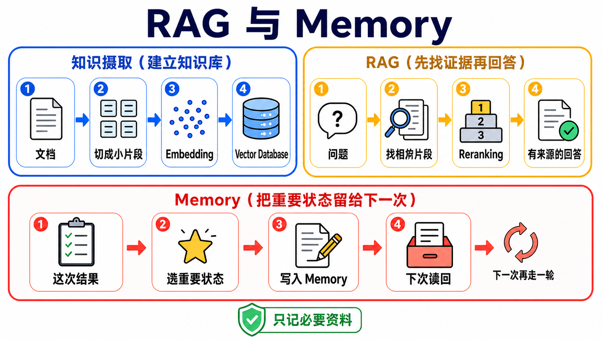

# Stage 6 — RAG 与 Memory：先找数据，再记住重要的事

> [繁體中文](./06-memory-rag.md) | **简体中文** | [English](./06-memory-rag.en.md)

<!-- freshness: canonical=stages/06-memory-rag.md; verified_on=2026-08-28; scope=rag,retrieval,embeddings,vector-stores,memory,evaluation,project-status; max_age_days=90 -->

模型不是什么都知道。**RAG** 像叫它先翻书再回答；**Memory** 像给它一本笔记本，记住下次还会用到的事。这一关会把两者分清楚，再带你一步一步做出来。

<a id="agent-需要的两种-context-能力"></a>
<a id="-context-engineering-是什么先定位"></a>
<a id="在五层-stack-里的位置"></a>
<a id="本-stage-处理-4-个-sub-problem-中的-2-个lance-martin-2025-框架"></a>
<a id="四个常被混淆的概念"></a>
<a id="rag-vs-long-context-vs-fine-tuning--何时用什么"></a>
<a id="-进入条件"></a>
<a id="-必读材料"></a>
<a id="-单元指引渐进式流程"></a>
<a id="-进阶-rag-技巧跑完基础-rag-之后再看"></a>
<a id="-adaptive--agentic-rag--self-rag--crag--adaptive-rag2024-主轴"></a>
## 📌 学习目标

完成这一关后，你可以：

1. 用一句话说出 RAG 与 Memory 的差别。
2. 看懂 **Chunk**、**Embedding** 如何把数据变成可检索内容，再被找回来。
3. 做出一条最小 RAG 流水线，并让回答附上来源。
4. 知道什么数据值得记住，什么数据不该保存。
5. 用小型测试比较两个做法，不靠“感觉比较好”。

## 🧩 先认识七个核心术语

| 核心词 | 像什么 | 正确意思 |
|---|---|---|
| **Retrieval（检索）** | 去书架找几页可能有答案的书 | 收到问题后，从外部数据找出相关内容。 |
| **RAG（Retrieval-Augmented Generation）** | 先翻书，再用自己的话回答 | 先 retrieval，再把找到的内容交给模型生成答案。 |
| **Embedding（嵌入向量）** | 帮句子的意思做一张坐标卡 | 把文字转成一串数字，让意思接近的文字在向量空间里靠近。 |
| **Vector Store／Vector Database** | 会按“意思”找卡片的抽屉 | 保存 embedding，并用相似度找回相关数据；不同产品的存储与运维能力不同。 |
| **Chunk（文字片段）** | 把大书切成可拿取的小页卡 | 为了搜索与放进 context，把长文件切成较小片段。 |
| **Reranking（重新排序）** | 把第一次找来的卡片再排一次 | 用第二个方法重新评分候选内容，让更可能有用的片段排前面。 |
| **Memory（记忆）** | 助理自己的笔记本 | 把跨讯息或跨 session 还需要的状态写下来，之后再读回来；它不是聊天纪录的别名。 |



### 一张表先选对方法

| 你遇到的问题 | 先考虑 | 为什么 |
|---|---|---|
| 数据不长，而且这次回答用完就好 | **Long context** | 直接把数据放进这次请求，流程最短。 |
| 文件很多，问题来了才知道要找哪几段 | **RAG** | 先找相关片段，不必每次塞入全部文件。 |
| 助理下次仍要记得偏好、任务状态或过往结果 | **Memory** | 把值得保留的信息写入可再次读取的存储层。 |
| 想稳定改变模型的行为或特定能力 | **Fine-tuning** | 调整模型行为；它不会自动替你提供最新文件。 |

没有一个选项永远最好。请用自己的数据、问题与成功条件做评测。

## 🚪 进入条件与阅读路径

- **第一次学：**先读七个核心词，完成练习 1–4，再做短版自我检查。
- **要做长期助理：**接着完成练习 5，再展开 Memory 设计。
- **要研究或上线：**最后展开进阶 RAG、Chunking、评测与研究入口。

<details markdown="1">
<summary>时间、环境、费用与数据安全</summary>

- 建议分两到三次完成；每次先做一个能跑的练习。
- 需要 Python、Git 与终端机。安装方式以各练习 README 为准。
- Path A 使用 OpenAI 兼容示例；Path B 使用 Anthropic 路径。模型与 embedding 调用可能产生费用。
- 先用小文件测试。不要把密码、token、医疗数据或未获授权的公司文件送到外部服务。
- API key 放在环境变量，不要写进程序或 commit。

</details>

## 📚 必修阅读

先看“RAG 的零件怎么接起来”，再开始第一个练习。

<details markdown="1">
<summary>阅读顺序与官方入口</summary>

1. [LangChain Retrieval](https://docs.langchain.com/oss/python/langchain/retrieval) — 看 loader、splitter、embedding、vector store 与 retriever 怎么合作。
2. [LlamaIndex concepts](https://developers.llamaindex.ai/python/framework/getting_started/concepts/) — 用文件导向的方式理解 indexing 与 querying。
3. [Chroma getting started](https://docs.trychroma.com/getting-started) — 看本地 vector database 的最小使用方式。
4. [LangGraph Agentic RAG](https://docs.langchain.com/oss/python/langgraph/agentic-rag) — 完成基础 RAG 后，再看 agent 如何决定要不要查数据。

</details>

<a id="-动手练习基础示例性练习"></a>
## 🛠 动手练习

每题都已经有 starter。直接复制命令执行，不需要先抄一份空白答案。

<a id="练习-1embeddings"></a>
### 练习 1：把两句话变成 Embedding

**成果：**你会看到意思相近的两句话，比不相关的句子更靠近。

```powershell
cd examples/stage-6/01-embeddings
python starter.py
python starter_anthropic.py
```

[打开完整说明与检查方式](../examples/stage-6/01-embeddings/README.zh-Hans.md)。先用很少的句子，避免不必要的 API 费用。

<a id="练习-2vector-db"></a>
### 练习 2：把 Embedding 放进 Vector Database

**成果：**你能把文字放进 Chroma，再用一句问题找回相关片段。

```powershell
cd examples/stage-6/02-vector-db
python starter.py
python starter_anthropic.py
```

[打开完整说明与检查方式](../examples/stage-6/02-vector-db/README.zh-Hans.md)。练习数据不得包含秘密或个人信息。

<a id="练习-3chunking-对照"></a>
### 练习 3：比较三种 Chunking 方法

**成果：**你会看到切得太大、太小或重叠太多，各自会发生什么事。

```powershell
cd examples/stage-6/03-chunking-comparison
python starter.py
python starter_anthropic.py
```

[打开完整说明与检查方式](../examples/stage-6/03-chunking-comparison/README.zh-Hans.md)。不要先背一个“标准大小”；先看文件结构与测试结果。

<a id="练习-4完整-rag-流水线"></a>
### 练习 4：串起完整 RAG

**成果：**程序会先找数据，再回答，并显示它使用了哪些来源片段。

```powershell
cd examples/stage-6/04-full-rag-pipeline
python starter.py
python starter_anthropic.py
```

[打开完整说明与检查方式](../examples/stage-6/04-full-rag-pipeline/README.zh-Hans.md)。先用小型数据集；不要把“程序能跑”当成“回答一定正确”。

<a id="练习-5long-term-memory"></a>
### 练习 5：记住一项偏好

**成果：**本练习只会在程序仍运行时新增、搜索并读回一项偏好；临时存储不代表长期持久记忆。

```powershell
cd examples/stage-6/05-long-term-memory
python starter.py
python starter_anthropic.py
```

[打开完整说明与检查方式](../examples/stage-6/05-long-term-memory/README.zh-Hans.md)。只保存完成任务需要的数据，并提供查看、修改与删除的方法。

### 推荐小项目：会查资料、也会记偏好的助理

选三到五份你有权使用的小文件。让助理回答问题时列出来源，再只记住一项无敏感性的偏好，例如“回答先给短版”。成功条件是：找不到证据时会说不知道；重新启动后仍能读回偏好；你可以删掉这项记忆。

<details markdown="1">
<summary>RAG 基础流水线：数据怎么进去，答案怎么出来</summary>

## 🌐 RAG 基础流水线

RAG 有两条路：一条先整理数据，一条在问题来时找数据。

| 阶段 | 做什么 | 小孩版比喻 |
|---|---|---|
| Load | 读入 PDF、网页或数据库内容 | 把书搬到桌上 |
| Split | 切成 chunks | 把书分成小卡 |
| Embed | 把每张卡转成向量 | 帮意思做坐标 |
| Store | 保存向量与来源 metadata | 卡片放进有标签的抽屉 |
| Retrieve | 依问题找候选 chunks | 先拿出可能有答案的卡 |
| Rerank（可选） | 重新排候选内容 | 再检查哪张卡最有用 |
| Generate | 把问题与证据交给模型 | 看著卡片回答 |
| Cite／Evaluate | 显示来源并检查结果 | 告诉别人答案从哪里来 |

**Retriever** 是“收到问题后，回传相关文件”的接口。它不一定使用 vector database；BM25、SQL、网站搜索与混合搜索也能成为 retriever。

</details>

<details markdown="1">
<summary>进阶 RAG 名词：什么问题出现时才需要加</summary>

<a id="-rag-进阶技巧概览--2025-2026-年的三大主线-"></a>
## 🚀 进阶 RAG 技巧（跑完基本 RAG 之后再看）

先建立基线，再一次只加一个元件。否则即使分数变好，你也不知道是哪一步造成的。

### 🔗 GraphRAG — 知识图谱 + RAG

**GraphRAG** 会先找出 entity（人、地点、产品等）与 relationship，再用图的连线帮助跨文件或整体主题的查询。它需要额外 indexing 成本，不是每个小型问答都需要。

- [Microsoft GraphRAG](https://github.com/microsoft/graphrag) — MIT 授权的研究参考实现；官方目前标示为维护模式，适合研究方法与既有部署，不应写成快速演进的一般产品。
- [GraphRAG paper](https://arxiv.org/abs/2404.16130) — 原始方法与 query-focused summarization。
- [LightRAG](https://github.com/HKUDS/LightRAG) — 另一个活跃的 graph-based RAG 实现；架构、数据模型与 Microsoft GraphRAG 不相同。

<a id="-contextual-retrieval--anthropic-的-prompt-caching-解决方案"></a>
### 🪶 Contextual Retrieval — 先替 chunk 补上背景

**Contextual Retrieval** 在建立索引时，先替每个 chunk 加上它在整份文件里的背景，再做 embedding 与 BM25。Anthropic 的实验中，contextual embedding、contextual BM25 与 reranking 把其测试的 top-20 chunk retrieval failure rate 从 5.7% 降到 1.9%；这是特定数据与设定的结果，不是所有 RAG 的保证。

- [Anthropic Contextual Retrieval](https://www.anthropic.com/engineering/contextual-retrieval)
- [Anthropic cookbook](https://platform.claude.com/cookbook/capabilities-contextual-embeddings-guide)

<a id="-hybrid-search--reranking--production-rag-的两个常见强化组件"></a>
<a id="-常用-memory--rag-工具推荐按用途分类"></a>
## 🎯 Hybrid Search 与 Reranking

**BM25** 擅长找完全相同或接近的字；vector search 擅长找意思相近的句子。**Hybrid Search** 把两种候选合在一起；**Reranking** 再看问题与候选片段的配对，把更有用的排前面。

可从 [Qdrant hybrid queries](https://qdrant.tech/documentation/concepts/hybrid-queries/)、[Weaviate hybrid search](https://docs.weaviate.io/weaviate/search/hybrid) 或 PostgreSQL full-text search + [pgvector](https://github.com/pgvector/pgvector) 开始。效果与延迟必须用自己的查询集测量。

<a id="query-transformations--hyde--multi-query--rag-fusion"></a>
### Query Transformations — HyDE、Multi-Query、RAG Fusion

- **HyDE**：先产生一段假想答案，再用它找数据。适合用户问题太短，但假想答案也可能带偏搜索。
- **Multi-Query**：把同一问题改写成数个角度，各自搜索后合并结果。
- **RAG Fusion**：对多个查询结果做 rank fusion，降低只靠一次查询措辞的风险。

### 🔁 Self-RAG、CRAG、Adaptive RAG 与 Agentic RAG

- **Self-RAG**：模型学习判断何时检索，并对证据与回答做反思。
- **CRAG（Corrective RAG）**：先判断取回内容是否够好，不够时改查询或改来源。
- **Adaptive RAG**：依问题难度选不同 retrieval 流程。
- **Agentic RAG**：把 retrieval 做成工具，让 agent 决定何时与如何使用；自由度增加，也增加延迟、成本与除错难度。

原始入口：[Self-RAG](https://arxiv.org/abs/2310.11511)、[CRAG](https://arxiv.org/abs/2401.15884)、[Adaptive-RAG](https://arxiv.org/abs/2403.14403)、[LangGraph Agentic RAG tutorial](https://docs.langchain.com/oss/python/langgraph/agentic-rag)。

<a id="-raptor--阶层式递归检索iclr-2024"></a>
### 🌳 RAPTOR — 用摘要树找不同层次的内容

**RAPTOR** 反复群聚并摘要文字，形成由细到粗的树。细节问题可以找叶节点，主题问题可以找较高层摘要。它和用 entity relationship 建图的 GraphRAG 不同。[RAPTOR paper](https://arxiv.org/abs/2401.18059)。

<a id="-dspy--不写-prompt用程序自动优化path-3-范式"></a>
### 🧬 DSPy — 用数据与指标调整 LLM program

**DSPy** 把 prompt 与模组组成可最佳化的 program，再用 examples 与 metric 搜索较好的设定。它不是“不用描述任务”，也不会替你自动修好坏数据。[stanfordnlp/dspy](https://github.com/stanfordnlp/dspy)。

</details>

<details markdown="1">
<summary>Memory 设计：要记什么、何时写、何时忘</summary>

<a id="stage-6--上下文管理context-engineeringrag-与-memory"></a>
<a id="先把名词切开retrieval--rag--vector-store--memory-不是同一件事"></a>
<a id="-5-个可上生产的-memory-layer按-use-case-选"></a>
<a id="2024-2026-最新-memory-作品--三大主线"></a>
## 🌉 从 RAG 到 Memory — 为什么 RAG 还不够

RAG 通常从外部知识找数据；Memory 保存 agent 自己之后还需要的状态。产品手册适合放知识库，用户允许保存的偏好才适合放 memory。不要把整段聊天不加选择地永久保存。

## 🧠 Memory 是什么 + 怎么设计

设计 Memory 时先回答四题：**写什么、何时写、怎么找、何时改或删**。

### Working memory vs Long-term memory — 两种时间尺度

- **Working memory**：目前任务正在使用的短期状态，例如现在做到哪一步。
- **Long-term memory**：跨 session 还需要的信息，例如经用户同意保存的偏好。

### Episodic / Semantic / Procedural memory — 三种内容类型

- **Episodic memory**：发生过什么，例如上次部署失败的原因。
- **Semantic memory**：较稳定的事实，例如项目使用 Python 3.13。
- **Procedural memory**：怎么做，例如发版前的检查步骤。

### 3 种设计 pattern（什么时候用什么）⭐ Track B 必看

1. **直接状态表**：栏位清楚、容易查看与删除，先从这里开始。
2. **可搜索的文字 memory**：内容较自由，写入时要保存来源、时间与拥有者。
3. **时间知识图谱**：关系会变、需要追踪“何时有效”时才考虑，成本与治理最复杂。

### ⭐ 现行 Memory 项目怎么选

- [Mem0](https://github.com/mem0ai/mem0)：Apache-2.0，可自架 library／server，也有托管服务；适合练习 add、search、update、delete 的记忆生命周期。
- [Letta Code](https://github.com/letta-ai/letta-code)：Letta 现行开发入口，强调 stateful agent 与 memory；旧 `letta-ai/letta` V1 server 只作历史参考。
- [Graphiti](https://github.com/getzep/graphiti)：Apache-2.0 的 temporal context graph engine，适合研究会随时间改变的关系。
- [LangMem](https://github.com/langchain-ai/langmem)：MIT，与 LangGraph store 整合；适合已采用 LangGraph 的项目。
- [Zep](https://github.com/getzep/zep)：现行产品以 Zep Cloud 与 examples／integrations 为主；Community Edition 已 deprecated 并移到 `legacy/`。

### 进阶：CoALA framework — agent memory 的 4 层 taxonomy

**CoALA** 把 language agent memory 分成 working、episodic、semantic 与 procedural 等部分，并关注 memory 如何被写入、读取与更新。它是分析框架，不是必装的数据库。[CoALA paper](https://arxiv.org/abs/2309.02427)。

<a id="进阶generative-agents--三重评分加权经典案例"></a>
### 进阶：Generative Agents — 三分数打分（经典案例）

Generative Agents 以 recency、importance、relevance 选择要取回的记忆，再用 reflection 产生较高层摘要。这是研究设计，不代表每个 production system 都使用同一公式。[Generative Agents paper](https://arxiv.org/abs/2304.03442)。

</details>

<details markdown="1">
<summary>Chunking、Reflexion 与评测：怎么知道真的变好</summary>

## 🧩 Chunking 细节（技术深入）

Chunk 太大时，一张卡会混进太多主题；太小时，答案需要的上下文可能被切散。可先从文件本身的标题与段落切，再用测试调整。

常见方法：

- **Fixed-size**：容易重现，但可能在句子中间切开。
- **Recursive／structure-aware**：先依标题、段落、句子切，通常较符合文件结构。
- **Sentence window**：用小句子搜索，取回时带前后文。
- **Parent-child／small-to-big**：小 chunk 负责搜索，较大的 parent 负责回答。
- **Semantic chunking**：依意思转折切分，计算较多，也需要更仔细评测。

每笔 chunk 至少保留来源文件、位置或页码、版本与存取权限。Overlap 不是越大越好；它会增加索引量与重复内容。

## 🪞 进阶：带持久记忆的 Reflexion 完整版 ⭐ Track B 选读

**Reflexion** 让 agent 在尝试后写下回馈，下一次再读取。要成为真正的 persistent memory，回馈必须存到 process 结束后仍存在的存储层，并且可以查看、修改与删除。[Reflexion paper](https://arxiv.org/abs/2303.11366)。

### 📚 想动手 / 想深入

- 先替一个失败案例写一条短 reflection，再重跑同一题。
- 比较“没有 reflection”与“有 reflection”是否改善明确成功条件。
- 不要保存模型臆测、秘密或无期限的用户数据。

<a id="-进阶-reasoning--reflection--2024-2026-年思潮--覆盖两种路径"></a>
<a id="path-1-prompt-based-reflection--reasoning传统做法"></a>
<a id="path-2-trained-in-reasoning--reflection2024-2026-年重大转变"></a>
<a id="两条路径如何选择"></a>
## 🤔 进阶 Reasoning / Reflection — 两条路

- **Prompt-based reflection**：执行后用 prompt 检查错误、产生改进建议；容易试验，但可能重复同样错误。
- **Trained-in reasoning**：模型在训练中学到更强的推理行为；用户仍要检查答案与证据，不能把隐藏推理当成可靠来源。

## 📏 RAG / Memory Eval — 跑得起来 ≠ 跑得准

至少分开量三件事：

1. **Retrieval**：正确证据有没有被找回来？
2. **Answer**：回答是否被证据支持、是否真的回答问题？
3. **Memory**：该记的能否读回、不该记的是否被拒绝或删除？

建立一小组有人检查过的问题、答案与来源。记录每次变更前后的结果；不要只看一个总分。

- [Ragas](https://github.com/vibrantlabsai/ragas) — Apache-2.0 的 LLM application evaluation toolkit；现行 canonical owner 是 Vibrant Labs。
- [TruLens](https://github.com/truera/trulens) — evaluation 与 observability 工具。
- [LangSmith evaluation](https://docs.langchain.com/langsmith/evaluation) — LangChain 的托管 evaluation／tracing 服务。

</details>

<a id="-精选-projects模板--规范--示例合集"></a>
<a id="进阶coala-framework--agent-memory-的-4-层分类法"></a>

## 🎯 精选项目与学习资源

先从 **LlamaIndex 或 LangChain + Chroma** 理解最小流水线；已有 PostgreSQL 才优先看 pgvector。不要一次安装整张表。

<details markdown="1">
<summary>18 个已查核入口、编辑评分与限制</summary>

<small>数据查核：2026-08-28 UTC</small>

<table>
  <thead>
    <tr><th scope="col">分类</th><th scope="col">项目</th><th scope="col">编辑评分</th><th scope="col">适合谁</th><th scope="col">能学什么</th><th scope="col">状态／限制</th></tr>
  </thead>
  <tbody>
    <tr><th scope="rowgroup" rowspan="4">RAG framework</th><td><a href="https://github.com/run-llama/llama_index">LlamaIndex</a></td><td>⭐⭐⭐⭐⭐</td><td>文件型应用初学者</td><td>Index、retriever、query engine</td><td>MIT；套件多，先用官方 starter</td></tr>
    <tr><td><a href="https://github.com/infiniflow/ragflow">RAGFlow</a></td><td>⭐⭐⭐⭐⭐</td><td>想看完整 Web 产品的团队</td><td>文件解析、hybrid retrieval、UI</td><td>Apache-2.0；部署比教学示例重</td></tr>
    <tr><td><a href="https://github.com/HKUDS/LightRAG">LightRAG</a></td><td>⭐⭐⭐⭐</td><td>研究 graph-based RAG 的读者</td><td>graph + vector retrieval</td><td>MIT；研究导向，不等同 Microsoft GraphRAG</td></tr>
    <tr><td><a href="https://github.com/deepset-ai/haystack">Haystack</a></td><td>⭐⭐⭐⭐</td><td>想比较另一套 pipeline framework</td><td>components、pipelines、evaluation</td><td>Apache-2.0；先选一套 framework 练习</td></tr>
  </tbody>
  <tbody>
    <tr><th scope="rowgroup" rowspan="5">Vector data</th><td><a href="https://github.com/chroma-core/chroma">Chroma</a></td><td>⭐⭐⭐⭐⭐</td><td>第一次在本机做向量搜索</td><td>collection、add、query</td><td>Apache-2.0；练习与 production 设定不同</td></tr>
    <tr><td><a href="https://github.com/qdrant/qdrant">Qdrant</a></td><td>⭐⭐⭐⭐⭐</td><td>需要自架或托管服务的团队</td><td>dense、sparse、hybrid query</td><td>Apache-2.0；需规划服务与备份</td></tr>
    <tr><td><a href="https://github.com/weaviate/weaviate">Weaviate</a></td><td>⭐⭐⭐⭐</td><td>需要 schema 与 hybrid search</td><td>BM25 + vector search</td><td>BSD-3-Clause；功能多，先做小型基线</td></tr>
    <tr><td><a href="https://github.com/pgvector/pgvector">pgvector</a></td><td>⭐⭐⭐⭐</td><td>已使用 PostgreSQL 的团队</td><td>SQL 与 vector 同库</td><td>PostgreSQL extension；仍需索引与查询调校</td></tr>
    <tr><td><a href="https://github.com/lancedb/lancedb">LanceDB</a></td><td>⭐⭐⭐⭐</td><td>想把 vector data 放进 app 的开发者</td><td>embedded／serverless vector workflows</td><td>Apache-2.0；依部署模式确认能力</td></tr>
  </tbody>
  <tbody>
    <tr><th scope="rowgroup" rowspan="4">Agent memory</th><td><a href="https://github.com/mem0ai/mem0">Mem0</a></td><td>⭐⭐⭐⭐⭐</td><td>要做跨 session 偏好记忆</td><td>add、search、update、delete</td><td>Apache-2.0；OSS 与托管平台分开评估</td></tr>
    <tr><td><a href="https://github.com/letta-ai/letta-code">Letta Code</a></td><td>⭐⭐⭐⭐</td><td>研究 stateful agent</td><td>memory-first agent runtime</td><td>Apache-2.0；旧 Letta V1 server 已退役</td></tr>
    <tr><td><a href="https://github.com/getzep/graphiti">Graphiti</a></td><td>⭐⭐⭐⭐</td><td>需要时间关系图的开发者</td><td>temporal context graph</td><td>Apache-2.0；需要图数据库与治理</td></tr>
    <tr><td><a href="https://github.com/langchain-ai/langmem">LangMem</a></td><td>⭐⭐⭐⭐</td><td>已使用 LangGraph 的团队</td><td>hot-path／background memory</td><td>MIT；依赖 LangGraph store 概念</td></tr>
  </tbody>
  <tbody>
    <tr><th scope="rowgroup" rowspan="3">进阶与评测</th><td><a href="https://platform.claude.com/cookbook/capabilities-contextual-embeddings-guide">Anthropic Contextual Retrieval cookbook</a></td><td>⭐⭐⭐⭐⭐</td><td>完成基础 RAG 的读者</td><td>contextual chunks 与评测</td><td>供应商示例；数字只适用其测试设定</td></tr>
    <tr><td><a href="https://github.com/stanfordnlp/dspy">DSPy</a></td><td>⭐⭐⭐⭐⭐</td><td>已有 dataset 与 metric 的开发者</td><td>最佳化 LLM programs</td><td>MIT；不是初学 RAG 的第一步</td></tr>
    <tr><td><a href="https://github.com/vibrantlabsai/ragas">Ragas</a></td><td>⭐⭐⭐⭐⭐</td><td>要建立可重跑 eval 的团队</td><td>datasets、metrics、experiments</td><td>Apache-2.0；metric 仍需人工校准</td></tr>
  </tbody>
  <tbody>
    <tr><th scope="rowgroup" rowspan="2">完整产品与教程</th><td><a href="https://github.com/onyx-dot-app/onyx">Onyx</a></td><td>⭐⭐⭐⭐⭐</td><td>想读完整 AI assistant 架构</td><td>ingest、retrieval、chat、admin</td><td>完整产品很大；当架构参考，不当 starter</td></tr>
    <tr><td><a href="https://github.com/NirDiamant/RAG_Techniques">RAG_Techniques</a></td><td>⭐⭐⭐⭐⭐</td><td>想比较多种技巧的读者</td><td>可执行 notebooks 与技术对照</td><td>社群教程；事实仍回到官方文件与论文核对</td></tr>
  </tbody>
</table>

</details>

## ✅ 进入 Stage 7 前的自我检查

- [ ] 我能说出 Retrieval、RAG 与 Memory 各自做什么。
- [ ] 我能解释 chunk、embedding 与 vector database 怎么接起来。
- [ ] 我的 RAG 回答会显示来源，找不到证据时会说不知道。
- [ ] 我能用一小组问题比较修改前后，而不是只看一次漂亮回答。
- [ ] Memory 只保存必要且获准的数据，用户能查看、修改与删除。

都能做到后，前往 [Stage 7 — Multi-Agent 与 Production](07-multi-agent-production.zh-Hans.md)。
