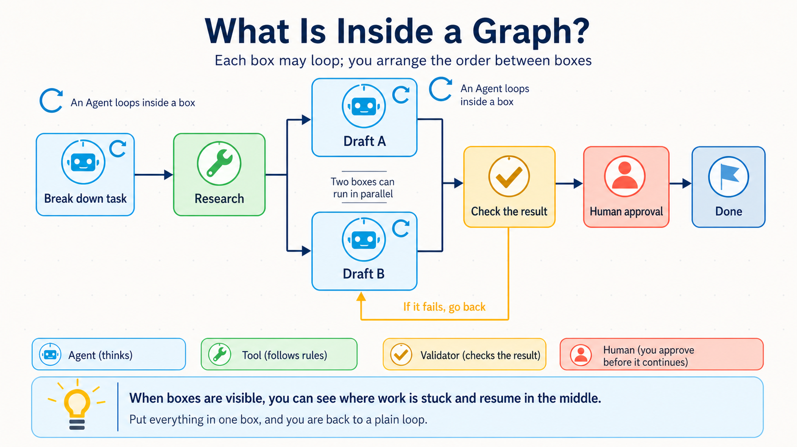

# Stage 7 — Agent Production Engineering: Harness, Loops, and Graphs

> [繁體中文](./07-multi-agent-production.md) | [简体中文](./07-multi-agent-production.zh-Hans.md) | **English**

This stage is **Agent Production Engineering**: give the Agent a **Harness** where it can work safely, design a Loop that continues or stops based on evidence, and arrange the whole route with a Workflow Graph. It should do more than “succeed once”: you should be able to see and check its work, and it should stop safely when something goes wrong.

## 🎯 What This Stage Does (Start Here)

**Multi-Agent** means two or more Agents divide the work. Think of a group report: one person researches, one writes, and one checks.

**Production** does not have to mean “serving a million people.” If someone else will actually use the Agent, you need to know what it did, what it cost, and what happens after a failure.

Remember one rule:

> **Start with one Agent. Add Agents only when the work can truly be separated or when distinct roles must check one another.**

| Your work | Recommendation | Why |
|---|---|---|
| One worker can finish it in one path | Single Agent | Easiest to understand, test, and repair |
| Many independent searches can happen at once | Parallel Agents | May reduce waiting, but uses more tokens |
| The “worker” and “reviewer” must be separate | Multi-Agent roles | Avoids having one Agent do the work and approve itself |
| Steps have a fixed order or approval point | Workflow / Graph | Makes order, state, and human approval visible |

<details markdown="1">
<summary>⏱ Expand: time, environment, cost, and safety notes</summary>

- Split this stage into several short practice sessions. You do not need to finish it at once.
- You need Python and Git. The deployment exercise also uses Docker.
- Run the tests that need no API key first. Set a small budget before calling a paid model.
- A trace may contain prompts, tool inputs, and model answers. Do not send passwords, personal data, or customer data directly to a tracing service.
- Another Agent usually adds another model call, more latency, and more debugging. Do not assume Multi-Agent is automatically faster or more accurate.

</details>

## 📌 Learning Goals

After this stage, you can:

1. Explain when a single Agent is enough and when **Multi-Agent** is justified.
2. Distinguish **Harness**, **Agent Loop**, and **Workflow Graph**: they work together, but none replaces the others.
3. Use an **Eval** to check quality instead of saying, “It looks fine to me.”
4. Use **Observability** to see steps, errors, latency, and token usage.
5. Add a **Guardrail**, human approval, and recovery before other people use the Agent.

## 🧩 Nine Core Terms

| Core term | Plain-language meaning | Precise meaning |
|---|---|---|
| **Multi-Agent** | Several helpers work together | Multiple Agents complete a task with explicit roles |
| **Orchestration** | A conductor decides who acts next | The order, data flow, roles, and stop conditions of execution |
| **Handoff** | One runner passes the baton | One Agent passes control and the needed context to another Agent |
| **Harness** | A safe workspace where the Agent does its job | The execution system that calls models, routes tools, and manages permissions, sandboxes, state, errors, and records; it commonly runs the Agent Loop too |
| **Eval** | A small test that checks whether it really works | Fixed cases and scoring rules used to measure behavior |
| **Observability** | A clear window into the system | Traces, logs, and metrics that reveal internal state |
| **Guardrail** | A rail at the edge of the playground | Rules that limit inputs, outputs, tool permissions, or risky actions |
| **Loop Engineering** | Do one step, check it, then decide whether to continue | Design the Agent Loop's goals, feedback, verification, budget, state, stopping, and human escalation |
| **Graph Engineering** | Draw the whole work map, with a next stop for every box | Organize nodes, edges, branches, parallel paths, state, checkpoints, and human approval with a Workflow Graph |

A **Prompt** is still the instruction and material you give the model. This stage does not throw prompts away; it adds an execution, checking, and recovery system around them.

## 🚪 Entry Conditions

You should have completed at least:

- [Stage 4](04-agent-frameworks.en.md): know what Agents, Tools, and Workflows are.
- [Stage 5](05-claude-code-ecosystem.en.md): have seen tool permissions, Subagents, and development workflows.
- [Stage 6](06-memory-rag.en.md): know that Context, RAG, and Memory are different.

You can start even if Docker is new to you. Do Exercises 1–4 first and learn Docker for Exercise 5.

## 📚 Required Reading

Read these five first. They explain the relationship between Agent Loops, Workflow Graphs, and Multi-Agent systems:

1. [Anthropic — Building Effective Agents](https://www.anthropic.com/engineering/building-effective-agents): start with simple compositions and add autonomy only when needed.
2. [OpenAI Agents SDK — Running agents](https://openai.github.io/openai-agents-python/running_agents/): see an Agent Loop repeat across the model, tools, and Handoffs, and stop with `max_turns`.
3. [OpenAI Agents SDK — Multi-agent orchestration](https://openai.github.io/openai-agents-python/multi_agent/): compare a manager that calls Agents with **Handoffs**.
4. [LangGraph — Workflows and agents](https://docs.langchain.com/oss/python/langgraph/workflows-agents): distinguish fixed Workflows from Agents that choose their next step.
5. [Microsoft Agent Framework — Workflow concepts](https://learn.microsoft.com/en-us/agent-framework/concepts/workflows/): see how executors, edges, events, and state form a Workflow Graph.

<details markdown="1">
<summary>📖 Expand: further reading and purpose</summary>

1. [Anthropic — Develop tests and evaluations](https://platform.claude.com/docs/en/test-and-evaluate/develop-tests): define measurable success before choosing a grader.
2. [OpenAI Agents SDK — Tracing](https://openai.github.io/openai-agents-python/tracing/): understand trace, span, tool, handoff, and guardrail events.
3. [OpenAI Agents SDK — Testing utilities](https://openai.github.io/openai-agents-python/testing/): test with repeatable fake models instead of paying for every run.
4. [OpenAI — Harness engineering](https://openai.com/index/harness-engineering/): see how environments, feedback loops, and mechanical rules help Agents work reliably.
5. [OpenTelemetry — GenAI semantic conventions](https://github.com/open-telemetry/semantic-conventions-genai): learn portable tracing fields; the conventions are evolving, so do not assume every platform supports all of them.

</details>

<a id="the-five-layer-engineering-split-prompt--context--harness--loop--graph"></a>
## Five Control Questions: Prompt → Context → Harness → Loop → Graph

These are five **check questions**, not five product layers. The Agent Loop manages one Harness run; Loop Engineering manages how a long task observes, adjusts, and stops; the Graph arranges its route. They work together; none replaces another.

| Control surface | Plain-language question | What runs | Work that designs it | First encountered | Deepened here |
|---|---|---|---|---|---|
| 1 | Did I explain the request clearly? | **Prompt** | **Prompt Engineering** | [Stage 2](02-prompt-engineering.en.md) | The Prompt and Eval in every stage |
| 2 | Did I include the information it needs? | **Context** | **Context Engineering** | [Stage 2](02-prompt-engineering.en.md) to distinguish Prompt and Context | RAG / Memory in [Stage 6](06-memory-rag.en.md) |
| 3 | Can it use tools safely and stop after failure? | **Agent Harness** | **Harness Engineering** | The runner / tool boundary in [Stage 3](03-tool-use-and-hello-agent.en.md) | Examples in [Stage 5](05-claude-code-ecosystem.en.md) and this stage's production checklist |
| 4 | How does it act, inspect, and act again without running forever? | **Agent Loop**; an outer loop may rerun the Harness | **Loop Engineering**: goals, evidence, adjustment, and stopping for long work | [Stage 3](03-tool-use-and-hello-agent.en.md) | This stage's long-task loop |
| 5 | Can every step, branch, and return path be seen and controlled? | **Workflow Graph** | **Production orchestration**; emerging writing may also say Graph Engineering | The Workflow Graph in [Stage 4](04-agent-frameworks.en.md) | This stage's production orchestration |

- **Stage 3: Agent Loop entry** — learn one execution of “model → tool → result → next step.”
- **Stage 4: Workflow Graph entry** — use framework parts to draw nodes, edges, branches, and state.
- **Stage 7: Agent Production Engineering integration** — connect Harness, Loop, and Graph, then add budgets, verification, checkpoints, human approval, observability, and recovery.

Stage 4 introduces the **Workflow Graph** and the **Agent Frameworks** that can implement it. Stage 7 makes that same map observable and recoverable as production orchestration. A framework is the toolbox, not the work map or the production discipline itself.


IBM explicitly describes **Loop Engineering** as an emerging practice. **Graph Engineering** is looser still; major framework documentation usually says **workflow**, **graph-based execution**, or **orchestration**. This stage keeps both labels so you can understand outside discussions, but teaches the actual responsibilities instead of presenting them as one industry-wide standard.

Definition sources: [IBM — Loop Engineering](https://www.ibm.com/think/topics/loop-engineering), [Anthropic — agent harness definition](https://www.anthropic.com/engineering/demystifying-evals-for-ai-agents), and [Microsoft Agent Framework — graph-based workflows](https://learn.microsoft.com/en-us/agent-framework/concepts/workflows/builder-and-execution).

## 🧭 What Does Harness, Loop, and Graph Each Control?

They are not three product generations, nor does a newer one replace an older one. One system can contain all three:

| Responsibility | Plain-language meaning | What it manages | Common misunderstanding |
|---|---|---|---|
| **Harness** | The Agent's safe workbench | Processes input, calls the model, routes tools, returns results, and manages permissions, sandbox, state, errors, and logs | It is only a tool wrapper, or a Loop makes it obsolete |
| **Loop** | Do one step, inspect evidence, then continue, stop, or ask a person | Goals, actions, observations, adjustments, budgets, stopping, and human escalation | It is only `for`/`while`, or a newer Harness |
| **Graph** | A map of all stops, forks, and return routes | Nodes, edges, branches, parallel work, checkpoints, and human approval | Every node must be an Agent |

In practice the boundaries necessarily overlap. Anthropic describes a harness as a loop that calls Claude and routes tools; the OpenAI Agents SDK Runner also executes an agent loop. The point is not to police wording, but to debug with three questions: **What makes the system execute safely? Why should it take another round? How does the whole route proceed?**

## 🏗 Harness Engineering — Production Agent Runtime Design ⭐ Core Concept of This Stage

**Harness Engineering** means designing the runtime that lets a model act as an Agent. The model produces decisions; the Harness processes input, tools, state, permissions, failures, and results, and it often runs the agent loop directly. An outer scheduler may call the Harness many times, so a Harness is not limited to “one short run.” Sources: [OpenAI — Harness engineering](https://openai.com/index/harness-engineering/), [Anthropic — agent harness definition](https://www.anthropic.com/engineering/demystifying-evals-for-ai-agents), and [Anthropic — Managed agents](https://www.anthropic.com/engineering/managed-agents).

### The 8 Core Components of a Harness

These eight items are this project’s production checklist, not the world’s only official taxonomy.

| Component | Plain-language meaning | Question before release |
|---|---|---|
| **1. Orchestration / Run loop** | Decide what happens next | Who starts, who stops, and what if a handoff fails? |
| **2. Tool / Permission boundary** | Give it only the keys it needs | Which tools may read, write, or delete? |
| **3. Context / State / Checkpoint** | Save where it is now | Can it resume from the correct point? |
| **4. Retry / Recovery / Idempotency** | Try again without charging twice | Could a retry repeat an email, payment, or database write? |
| **5. Guardrail / Human approval** | Ask an adult before a risky action | Which actions always require approval? |
| **6. Telemetry / Observability** | Put a clear window on the system | Can we see traces, errors, latency, and tokens? |
| **7. Eval harness** | Retake the test after every change | Are cases, scoring rules, and failure thresholds fixed? |
| **8. Cost / Latency budget** | Decide the money and time limit first | Above budget, should it stop, downgrade, or queue? |

<details markdown="1">
<summary>🔧 Expand: feedback, recovery, and cost details</summary>

- Write tool errors as feedback an Agent can understand, not only a long stack trace.
- Keep the grader separate from the worker when possible. Do not ask only, “How good was your own work?”
- Design **idempotency** for every external side effect so a retry does not repeat a payment, email, or data write.
- Prompt caching, batching, model routing, and smaller models may reduce cost, but results depend on the workload. Measure a baseline, change one thing, and measure again.
- Anthropic prompt caching can be automatic or use explicit `cache_control`. Cache duration and read/write pricing depend on the option; use the [official documentation](https://platform.claude.com/docs/en/build-with-claude/prompt-caching).
- Traces may capture sensitive inputs and outputs. Configure redaction, retention, and access before release.

</details>

## 🔁 Loop Engineering — Let the Agent Act, Observe, Adjust, and Know When to Stop

First separate three kinds of Loop that sound similar but cover different scopes:

| Name | What repeats | Example |
|---|---|---|
| **Program loop** | The same code block | `for item in items`; this is syntax, not the topic of this section |
| **Agent Loop** | Model → tool → tool result → model | Keep calling tools inside one run until completion or `max_turns` |
| **Loop Engineering** | Goal → action → observation → adjustment | Repeat work in one long run or across sessions／schedules, with verification, memory, budgets, and stop conditions on every round |

IBM explains Loop Engineering as `Goal → Action → Observation → Adjustment`. The point is not to let an Agent run forever. Every round must answer: **Is the goal still valid? Is the evidence enough? Should we continue, stop, or hand control to a person?**

Therefore, Loop Engineering **is not the next Harness product generation and does not automatically replace a Harness**. In Anthropic's terminology, the Harness itself includes the loop that calls the model and routes tools. IBM's broader Loop Engineering practice includes goals, checking, tools, hooks, context, subagents, and persistent state. Sources draw the boundary differently, so remember the responsibilities instead of memorizing one universal layer diagram. Sources: [IBM — Loop Engineering](https://www.ibm.com/think/topics/loop-engineering) and [Anthropic — Managed Agents](https://www.anthropic.com/engineering/managed-agents).

When models improve, a particular patch may be removable. For example, Anthropic removed context resets used by an earlier harness for newer models. That only means **the same Evals showed one workaround was no longer needed**. It does not mean permissions, safety, logs, evals, or recovery automatically became obsolete. Source: [Anthropic — Harness design for long-running applications](https://www.anthropic.com/engineering/harness-design-long-running-apps). Stage 7.5 explains how to keep, simplify, or remove each part under [Model–Harness Fit](07.5-advanced-agentic-concepts.en.md).

<a id="-graph-engineering--arrange-steps-loops-and-approvals-into-a-complete-route"></a>
## 🗺 Workflow Graph / Production Orchestration — Arrange Steps, Loops, and Approvals into a Complete Route

A **Loop** is like washing a plate: wash it, inspect it, and wash it again if it is still dirty.<br>
A **Graph** is like a restaurant line: prepare, cook, and plate, with every box and order drawn out.

Outside writing sometimes calls this engineering work **Graph Engineering**. The label is emerging. What matters is learning nodes, edges, branches, cycles, state, checkpoints, and human approval—not memorizing a name that is not yet standardized.

> **A box can contain a loop; the graph arranges the order between boxes.**

<details markdown="1">
<summary>🧠 Expand: choosing a Loop, Graph, or Multi-Agent design</summary>

- Use a Loop when there is one path that may need many retries.
- Use a Graph / Workflow when there are branches, parallel steps, human approvals, or a need to resume in the middle.
- Add Multi-Agent only when parts can truly work independently or distinct roles must check one another.
- A Graph node can be an Agent, a tool, fixed code, or “wait for human approval.” Not every box needs an Agent.



</details>

## 🧭 What Is the Difference Between OpenRouter, Pi, OpenCode, Orca, and QM?

They are not five versions of the same product. Put each one at the right layer:

| Name | What it is | One-line memory aid |
|---|---|---|
| [OpenRouter](https://openrouter.ai/docs/quickstart) | Model API gateway / router | Connects software to different models; it is not a coding Agent |
| [Pi](https://github.com/earendil-works/pi) | Agent toolkit and coding-agent CLI | Calls models and tools to finish a task |
| [OpenCode](https://github.com/anomalyco/opencode) | Open-source coding Agent | Reads, edits, and tests inside a code project |
| [Orca](https://github.com/stablyai/orca) | Multi-Agent development environment | Runs coding Agents in isolated worktrees for comparison |
| [QM](https://github.com/yc-software/qm) | Team Multi-Agent harness | Manages people, workspaces, permissions, schedules, and collaboration |

> **Model gateway → Agent runtime → Multi-Agent collaboration platform.** The three layers can work together, but they do not replace one another.

## 🛠 Hands-on Exercises

Each exercise includes a complete example. Do not rename files or copy everything into a blank file first. Run the test directly, then change one small thing.

### Exercise 1: Multi-Agent Debate

**Result:** two Agents make independent cases and a third Agent judges them with a rule.

```bash
cd examples/stage-7/01-multi-agent-debate
python test.py
```

### Exercise 2: Eval

**Result:** fixed cases and rules reveal which behavior regressed.

```bash
cd examples/stage-7/02-eval
python test.py
```

### Exercise 3: Observability

**Result:** see the steps, latency, tokens, and errors in one run.

```bash
cd examples/stage-7/03-observability
python test.py
```

### Exercise 4: Advanced SDK Features

**Result:** compare streaming and prompt caching; measure the cost effect yourself.

```bash
cd examples/stage-7/04-sdk-advanced
python test.py
```

### Exercise 5: Deploy

**Result:** wrap an Agent in an API with `/health` and `/chat`, then test its error states.

```bash
cd examples/stage-7/05-deploy
python test.py
```

<details markdown="1">
<summary>🛠 Expand: exercise order, paid paths, and what to observe</summary>

1. Run `python test.py` first in every folder. It uses mocks and needs no API key.
2. After tests pass, choose the local Ollama or Anthropic path in that folder’s README.
3. Change only one thing: a role prompt, grading rule, trace field, cache setting, or API error response.
4. Run the test again. Record what changed, which result moved, and whether it stayed within budget.
5. Docker in Exercise 5 is optional at first. Verify behavior with FastAPI tests before starting a service.

</details>

## 🧪 Recommended Mini-Project: A Research Team with a Receipt

Build a three-role team:

1. A **Researcher** finds three sources.
2. A **Writer** writes a short summary using only those sources.
3. A **Reviewer** checks citations, omissions, and uncertain claims with a fixed rubric.

Finally, produce an **execution receipt**: task ID, each step, tools used, sources, elapsed time, tokens, errors, and human approvals. Start with five fixed Eval questions. If any case regresses, do not deploy yet.

## 📊 Agent Benchmark Landscape: How to read it, not just the leaderboard + ⚠ Reward-Hacking Warning

A **Benchmark** is like a shared exam. It helps comparison, but it cannot promise that your real work will perform the same way.

Ask five questions before trusting a score:

| Check | Plain-language question |
|---|---|
| Task | Does the exam resemble my real work? |
| Environment | Which tools, data, and permissions did the model receive? |
| Grader | Who scored it, and can the rule be exploited? |
| Trajectory | Did it really solve the task, or only stumble into a score? |
| Hold-out | Did it pass my own tests that were not used for tuning? |

**Reward hacking** means “getting the score without achieving the real goal.” It is like a child learning that pressing a bell earns candy, then pressing the bell repeatedly instead of doing the assigned task.

<details markdown="1">
<summary>📊 Expand: useful Benchmarks and production evaluation</summary>

- [SWE-bench](https://www.swebench.com/): real software issues.
- [Terminal-Bench](https://github.com/harbor-framework/terminal-bench-1): terminal tasks.
- [OSWorld](https://github.com/xlang-ai/OSWorld): desktop-environment tasks.
- [τ²-bench](https://github.com/sierra-research/tau2-bench): tasks with tools and multi-turn interaction.
- [GAIA](https://huggingface.co/gaia-benchmark): general-assistant tasks.

Do not copy one SOTA score into the page as a permanent fact. Release decisions should use your own cases, rubric, complete trajectories, cost, and latency. Rerun the same hold-out cases whenever you change the model, Prompt, Tool, or Harness.

</details>

## 🎯 Featured Projects (Templates / SDKs / Tool Collections)

Choose one by purpose; do not install everything at once. Ratings show teaching usefulness in this project, not GitHub stars.

The 20 entries below are directly visible because readers may return here as a tool-selection map.

<table>
  <thead>
    <tr><th scope="col">Category</th><th scope="col">Project / document</th><th scope="col">Teaching fit</th><th scope="col">Best for</th><th scope="col">Know this first</th></tr>
  </thead>
  <tbody>
    <tr><th scope="rowgroup" rowspan="4">Orchestration / Workflow</th><td><a href="https://www.anthropic.com/engineering/building-effective-agents">Anthropic — Building Effective Agents</a></td><td>⭐⭐⭐⭐⭐</td><td>Learn simple workflows before Agents</td><td>A design guide, not a deployable framework</td></tr>
    <tr><td><a href="https://openai.github.io/openai-agents-python/multi_agent/">OpenAI Agents SDK orchestration</a></td><td>⭐⭐⭐⭐⭐</td><td>Compare manager and handoff patterns</td><td>Examples center on OpenAI Agents SDK</td></tr>
    <tr><td><a href="https://learn.microsoft.com/en-us/agent-framework/workflows/orchestrations/">Microsoft Agent Framework orchestrations</a></td><td>⭐⭐⭐⭐</td><td>Sequence, concurrency, handoff, group chat, and approval</td><td>Confirm current package version and preview status</td></tr>
    <tr><td><a href="https://github.com/langchain-ai/langgraph">LangGraph</a></td><td>⭐⭐⭐⭐⭐</td><td>State, checkpointing, and human-in-the-loop</td><td>More abstraction than a first Agent needs</td></tr>
  </tbody>
  <tbody>
    <tr><th scope="rowgroup" rowspan="6">Eval / Observability</th><td><a href="https://platform.claude.com/docs/en/test-and-evaluate/develop-tests">Anthropic — Develop tests and evaluations</a></td><td>⭐⭐⭐⭐⭐</td><td>Define success criteria and graders</td><td>You must supply cases that represent real work</td></tr>
    <tr><td><a href="https://github.com/promptfoo/promptfoo">promptfoo</a></td><td>⭐⭐⭐⭐⭐</td><td>Put Evals in CI</td><td>A config file cannot replace a good rubric</td></tr>
    <tr><td><a href="https://github.com/open-telemetry/semantic-conventions-genai">OpenTelemetry GenAI conventions</a></td><td>⭐⭐⭐⭐</td><td>Learn portable trace fields</td><td>The conventions evolve and support varies</td></tr>
    <tr><td><a href="https://github.com/langfuse/langfuse">Langfuse</a></td><td>⭐⭐⭐⭐⭐</td><td>Tracing, Eval, and prompt management</td><td>Self-hosting still needs operations and data governance</td></tr>
    <tr><td><a href="https://github.com/Arize-ai/phoenix">Arize Phoenix</a></td><td>⭐⭐⭐⭐</td><td>OpenTelemetry and local analysis</td><td>Design sensitive-data redaction first</td></tr>
    <tr><td><a href="https://github.com/comet-ml/opik">Opik</a></td><td>⭐⭐⭐⭐</td><td>Tracing and evaluation on one platform</td><td>Start with one trace before exploring every feature</td></tr>
  </tbody>
  <tbody>
    <tr><th scope="rowgroup" rowspan="6">Harness / Sandbox / Deploy</th><td><a href="https://github.com/anthropics/claude-agent-sdk-python">Claude Agent SDK Python</a></td><td>⭐⭐⭐⭐⭐</td><td>Read tool loops, permissions, and subagent code</td><td>Centers on the Claude runtime</td></tr>
    <tr><td><a href="https://github.com/deepseek-ai/deepseek-harness">DeepSeek Harness</a></td><td>⭐⭐⭐</td><td>Read a plugin-based harness architecture</td><td>Developer preview; breaking changes are possible</td></tr>
    <tr><td><a href="https://github.com/xai-org/grok-build">Grok Build</a></td><td>⭐⭐⭐</td><td>Compare coding-agent harness components</td><td>Read the README and safety boundaries before trying it</td></tr>
    <tr><td><a href="https://github.com/NVIDIA/NemoClaw">NemoClaw</a></td><td>⭐⭐⭐</td><td>Study sandbox and enterprise deployment direction</td><td>Alpha / best-effort; not a stable dependency</td></tr>
    <tr><td><a href="https://github.com/sandbaseai/sandbase-harness">SandBase Harness</a></td><td>⭐⭐⭐⭐</td><td>Study how a self-hosted runtime connects sessions, MCP, approvals, credentials, and audit/replay</td><td>Isolation for local, Docker, Kubernetes, and Worker backends depends on the backend and deployment; it is not a fixed microVM guarantee</td></tr>
    <tr><td><a href="https://github.com/bentoml/BentoML">BentoML</a></td><td>⭐⭐⭐⭐</td><td>Package an application as a service and container</td><td>A deployment framework does not add Evals or Guardrails for you</td></tr>
  </tbody>
  <tbody>
    <tr><th scope="rowgroup" rowspan="5">Multi-Agent Cases</th><td><a href="https://github.com/crewAIInc/crewAI">crewAI</a></td><td>⭐⭐⭐⭐</td><td>Understand role-based task division</td><td>More roles do not guarantee a better answer</td></tr>
    <tr><td><a href="https://github.com/stablyai/orca">Orca</a></td><td>⭐⭐⭐⭐</td><td>Run coding Agents in isolated worktrees</td><td>A person must still review and select parallel results</td></tr>
    <tr><td><a href="https://github.com/yc-software/qm">QM</a></td><td>⭐⭐⭐⭐</td><td>Study team workspaces, permissions, and schedules</td><td>Organization-wide deployment is more complex than a personal CLI</td></tr>
    <tr><td><a href="https://github.com/AMAP-ML/LongHorizon-Harness">LongHorizon-Harness</a></td><td>⭐⭐⭐</td><td>See Manager / Executor / Auditor roles</td><td>Very new, with limited long-term maintenance history</td></tr>
    <tr><td><a href="https://github.com/cft0808/edict">Edict</a></td><td>⭐⭐⭐</td><td>Learn planning, review, and execution roles from a Chinese-language case</td><td>Its special role names are a case design, not an industry standard</td></tr>
  </tbody>
</table>

<small>Verified: 2026-08-29 UTC</small>

## ✅ Self-Check After Stage 7

- [ ] I can distinguish OpenRouter, an Agent runtime, and a Multi-Agent platform in one sentence.
- [ ] I can explain why a single Agent should be the default.
- [ ] I have fixed Eval cases instead of one attractive output.
- [ ] I can find the trace, error, latency, and token count for one run.
- [ ] Risky tools have least privilege, human approval, and safe retry behavior.
- [ ] I can show an execution receipt that explains what the Agent did.

Next, go to [Stage 7.5 — Advanced Agentic Concept Map](07.5-advanced-agentic-concepts.en.md), then [Stage 8 — Agent Interfaces](08-agent-interfaces.en.md). If one item is still unclear, return to its exercise, change one thing, and test again.
