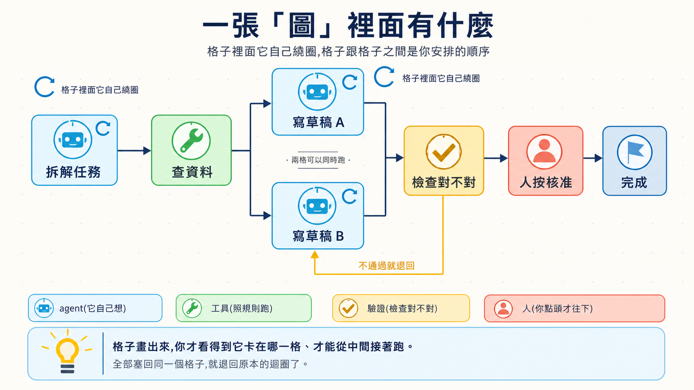

# Stage 7 — Agent Production Engineering：Harness、Loop 與 Graph

> **繁體中文** | [简体中文](./07-multi-agent-production.zh-Hans.md) | [English](./07-multi-agent-production.en.md)

這一關要做的是 **Agent Production Engineering（Agent 上線工程）**：替 Agent 蓋好能安全工作的 **Harness**，設計會依證據繼續或停止的 Loop，再用 Workflow Graph 排好完整路線。它不只要「偶爾成功」，還要能被看見、被檢查，出錯時也能安全停下來。

## 🎯 這一關在做什麼（先定位）

**Multi-Agent（多 Agent）**就是讓兩個以上的 Agent 分工。像一起做報告：有人找資料、有人寫、有人檢查。

**Production（可供使用）**不是「一定要服務一百萬人」。只要別人真的會用，你就要知道它做了什麼、花了多少、失敗後怎麼辦。

先記住一條規則：

> **先用一個 Agent。只有工作真的能分開，或需要不同角色互相檢查時，才增加 Agent。**

| 你的工作 | 建議 | 為什麼 |
|---|---|---|
| 一個人一次就能做完 | 單一 Agent | 最容易理解、測試和修理 |
| 可以同時找很多互不依賴的資料 | 多 Agent 平行探索 | 能縮短等待時間，但會多花 token |
| 需要「執行者」與「審查者」分開 | 多 Agent 分工 | 避免同一個 Agent 自己做、自己說沒問題 |
| 每一步有固定順序或核准點 | Workflow／Graph | 讓順序、狀態和人工核准看得見 |

<details markdown="1">
<summary>⏱ 展開：時間、環境、費用與安全提醒</summary>

- 建議分成數次短練習，不必一次做完。
- 需要 Python、Git；部署練習另需 Docker。
- 每個練習都先跑不需 API 金鑰的測試。要呼叫付費模型時，先設小額預算。
- Trace 可能包含提示、工具輸入與模型回答。不要把密碼、個資或客戶資料直接送進追蹤平台。
- 多一個 Agent 通常就多一份模型呼叫、延遲與除錯工作。不要假設多 Agent 一定比較快或比較準。

</details>

## 📌 學習目標

完成本章後，你能：

1. 說清楚什麼時候該用單一 Agent，什麼時候才需要 **Multi-Agent**。
2. 分清 **Harness**、**Agent Loop** 與 **Workflow Graph**，知道三者會合作，但不會互相淘汰。
3. 用 **Eval** 檢查品質，不只靠「我看起來覺得可以」。
4. 用 **Observability** 看見每一步、錯誤、延遲與 token 用量。
5. 加上 **Guardrail**、人工核准與復原方式，再把 Agent 交給別人使用。

## 🧩 九個核心詞

| 核心詞 | 五歲也能懂的說法 | 正確術語 |
|---|---|---|
| **Multi-Agent（多 Agent）** | 好幾個小幫手一起做事 | 多個 Agent 以明確角色共同完成任務 |
| **Orchestration** | 像指揮家，決定誰先做、誰後做 | 編排執行順序、資料流、角色與停止條件 |
| **Handoff** | 把接力棒交給下一個人 | 一個 Agent 把任務控制權與必要 context 交給另一個 Agent |
| **Harness** | Agent 做事時的安全工作間 | 呼叫模型、路由工具，並管理權限、sandbox、狀態、錯誤與紀錄的執行系統；裡面通常也會跑 Agent Loop |
| **Eval** | 出一張小考卷，看它是不是真的會 | 用固定案例與評分規則量測行為 |
| **Observability** | 裝上透明窗，知道它做到哪裡 | 用 trace、log、metrics 看見系統內部狀態 |
| **Guardrail** | 遊戲場邊的護欄 | 限制輸入、輸出、工具權限或高風險操作的規則 |
| **Loop Engineering** | 把「做、看、改」接起來，還要知道何時停 | 設計反覆執行的目標、觸發、觀察、驗證、記憶、預算、停止與人工升級 |
| **Graph Engineering** | 畫一張完整工作地圖，每一格都有下一站 | 用 Workflow Graph 組織 node、edge、分支、平行路線、state、checkpoint 與人工核准 |

**Prompt（提示）**仍然是你交給模型的指令與材料；本章不是把 Prompt 丟掉，而是替它加上能執行、檢查和復原的外圍系統。

## 🚪 進入條件

你至少應該完成：

- [Stage 4](04-agent-frameworks.md)：知道 Agent、Tool 與 Workflow 是什麼。
- [Stage 5](05-claude-code-ecosystem.md)：看過工具權限、Subagent 與開發流程。
- [Stage 6](06-memory-rag.md)：知道 Context、RAG 與 Memory 不一樣。

Docker 還不熟也可以開始；先做練習 1–4，練習 5 再補。

## 📚 必修閱讀

先讀這五份。它們會先把 Agent Loop、Workflow Graph 和多 Agent 的關係說清楚：

1. [Anthropic — Building Effective Agents](https://www.anthropic.com/engineering/building-effective-agents)：先用簡單組合，只有需要時才增加自主性。
2. [OpenAI Agents SDK — Running agents](https://openai.github.io/openai-agents-python/running_agents/)：看一次 Agent Loop 如何在模型、工具與 Handoff 之間反覆執行，並用 `max_turns` 停下來。
3. [OpenAI Agents SDK — Multi-agent orchestration](https://openai.github.io/openai-agents-python/multi_agent/)：比較「管理者呼叫其他 Agent」與 **Handoff**。
4. [LangGraph — Workflows and agents](https://docs.langchain.com/oss/python/langgraph/workflows-agents)：分清固定 Workflow 與會自己決定下一步的 Agent。
5. [Microsoft Agent Framework — Workflow concepts](https://learn.microsoft.com/en-us/agent-framework/concepts/workflows/)：看 executor、edge、event 與 state 怎麼組成 Workflow Graph。

<details markdown="1">
<summary>📖 展開：延伸閱讀與用途</summary>

1. [Anthropic — Develop tests and evaluations](https://platform.claude.com/docs/en/test-and-evaluate/develop-tests)：先寫可量測的成功標準，再選評分方式。
2. [OpenAI Agents SDK — Tracing](https://openai.github.io/openai-agents-python/tracing/)：理解 trace、span、tool、handoff 與 guardrail 事件。
3. [OpenAI Agents SDK — Testing utilities](https://openai.github.io/openai-agents-python/testing/)：用可重複的假模型測試，不必每次花 API 費用。
4. [OpenAI — Harness engineering](https://openai.com/index/harness-engineering/)：看環境、回饋迴路與機器規則如何幫 Agent 穩定工作。
5. [OpenTelemetry — GenAI semantic conventions](https://github.com/open-telemetry/semantic-conventions-genai)：認識可攜的追蹤欄位；規格仍在演進，不要假設所有平台都完整支援。

</details>

<a id="五層工程分工prompt--context--harness--loop--graph"></a>
## 五個控制問題：Prompt → Context → Harness → Loop → Graph

這是五個**檢查問題**，不是五層產品。Agent Loop 管一次 Harness run；Loop Engineering 管長任務的觀察、調整與停止；Graph 排整條路。它們合作，彼此不取代。

| 控制面 | 白話問題 | 會跑的東西 | 設計它的工作 | 先在哪裡遇見 | 在哪裡做穩 |
|---|---|---|---|---|---|
| 1 | 我有沒有把話說清楚？ | **Prompt** | **Prompt Engineering** | [Stage 2](02-prompt-engineering.md) | 每章的 Prompt 與 Eval |
| 2 | 我有沒有把該看的資料放進來？ | **Context** | **Context Engineering** | [Stage 2](02-prompt-engineering.md) 先分清 Prompt 與 Context | [Stage 6](06-memory-rag.md) 的 RAG／Memory |
| 3 | 它能不能安全地用工具、出錯後停下？ | **Agent Harness** | **Harness Engineering** | [Stage 3](03-tool-use-and-hello-agent.md) 的 runner／tool boundary | [Stage 5](05-claude-code-ecosystem.md) 的實例與本章的 production checklist |
| 4 | 它怎麼「做、看、再做」，又不會無限跑？ | **Agent Loop**；外層可重跑 Harness | **Loop Engineering**：長任務的目標、證據、調整與停止 | [Stage 3](03-tool-use-and-hello-agent.md) | 本章的長任務 loop |
| 5 | 每一步、分支與返回路線能不能被看見和控制？ | **Workflow Graph** | **Production orchestration**；新興文章也會寫 Graph Engineering | [Stage 4](04-agent-frameworks.md) | 本章的 production orchestration |

- **Stage 3：Agent Loop 入門**——先學一次執行裡的「模型 → 工具 → 結果 → 下一步」。
- **Stage 4：Workflow Graph 入門**——再用 framework 提供的零件畫 node、edge、branch 與 state。
- **Stage 7：Agent Production Engineering 整合**——把 Harness、Loop 與 Graph 接起來，再加入預算、驗證、checkpoint、人工核准、觀測與復原。

Stage 4 先教 **Workflow Graph** 和實作它的 **Agent Framework**；Stage 7 再把同一張圖做成可觀測、可復原的 production orchestration。Framework 是工具箱，不是工作地圖，也不是上線編排本身。


**Loop Engineering** 是 IBM 明確標為 emerging practice 的新興稱呼。**Graph Engineering** 更鬆散；主要框架的正式文件多半仍寫 **workflow**、**graph-based execution** 或 **orchestration**。本章保留這兩個詞，讓你看得懂外面的討論，但以實際責任為準，不把它們說成全業界共同標準。

定義來源：[IBM — Loop Engineering](https://www.ibm.com/think/topics/loop-engineering)、[Anthropic — Agent harness 定義](https://www.anthropic.com/engineering/demystifying-evals-for-ai-agents)、[Microsoft Agent Framework — graph-based workflows](https://learn.microsoft.com/en-us/agent-framework/concepts/workflows/builder-and-execution)。

## 🧭 Harness、Loop、Graph 各自管什麼？

它們不是三代產品，也不是「新的把舊的換掉」。同一套系統可以同時包含三者：

| 責任 | 五歲也能懂的說法 | 實際管理 | 最常見的誤會 |
|---|---|---|---|
| **Harness** | AI 做事的安全工作台 | 處理輸入、呼叫模型、路由工具、回傳結果，並管理權限、sandbox、狀態、錯誤與 log | 只是一層工具包，或有 Loop 後就不再需要 |
| **Loop** | 做一步、看證據，再決定繼續、停止或問人 | 目標、動作、觀察、調整、預算、停止與人工升級 | 只是 `for`／`while`，或是新版 Harness |
| **Graph** | 把所有站、岔路和回程畫成地圖 | node、edge、分支、平行、checkpoint 與人工核准 | 每個 node 都一定是一個 Agent |

實作時邊界一定會重疊。Anthropic 把 harness 描述成「呼叫 Claude 並路由工具的 loop」；OpenAI Agents SDK 也由 Runner 執行 agent loop。本章不是要抓誰用錯字，而是用三個問題幫你除錯：**系統靠什麼安全執行？它為什麼再跑一輪？整條路線怎麼走？**

## 🏗 Harness Engineering — production agent runtime 的工程設計 ⭐ 本 stage 核心概念

**Harness Engineering**就是設計讓模型能成為 Agent 的執行系統。模型負責產生決策；Harness 處理輸入、工具、狀態、權限、錯誤與結果，也常直接執行 agent loop。外層排程可以再呼叫 Harness 很多次，因此 Harness 不只等於「一次短 run」。來源：[OpenAI — Harness engineering](https://openai.com/index/harness-engineering/)、[Anthropic — Agent harness 定義](https://www.anthropic.com/engineering/demystifying-evals-for-ai-agents)、[Anthropic — Managed agents](https://www.anthropic.com/engineering/managed-agents)。

### Harness 的 8 個核心元件

這八項是本專案的 production 檢查表，不是全世界唯一的官方分類。

| 元件 | 五歲也能懂的說法 | 上線前要問 |
|---|---|---|
| **1. Orchestration／Run loop** | 決定下一步做什麼 | 誰開始、誰停止、交接失敗怎麼辦？ |
| **2. Tool／Permission boundary** | 只給它需要的鑰匙 | 哪些工具能讀、能寫、能刪？ |
| **3. Context／State／Checkpoint** | 保存它現在做到哪裡 | 中斷後能不能從正確位置繼續？ |
| **4. Retry／Recovery／Idempotency** | 跌倒能重來，又不會重複扣款 | 重試會不會重複寄信、付款或寫資料？ |
| **5. Guardrail／Human approval** | 危險動作先問大人 | 哪些操作一定要人按核准？ |
| **6. Telemetry／Observability** | 裝上透明窗 | 能不能看到 trace、錯誤、延遲與 token？ |
| **7. Eval harness** | 每次改動都重新考試 | 有固定案例、評分規則和失敗門檻嗎？ |
| **8. Cost／Latency budget** | 先說可以花多少錢和時間 | 超過預算時要停止、降級還是排隊？ |

<details markdown="1">
<summary>🔧 展開：回饋、復原與成本的實作重點</summary>

- 工具錯誤要寫成 Agent 看得懂的回饋，不只丟一大串 stack trace。
- 評分者最好和執行者分開；不要只問 Agent「你自己做得好不好」。
- 每個有外部副作用的動作都要設計 **idempotency（冪等）**，避免重試時重複付款、寄信或新增資料。
- Prompt caching、batching、model routing 與較小模型都可能省成本，但效果依工作而異。先量 baseline，再改一項，再重測。
- Anthropic prompt caching 可用自動方式或明確的 `cache_control`；快取期限與讀寫價格依方案不同，請以[官方文件](https://platform.claude.com/docs/en/build-with-claude/prompt-caching)為準。
- Trace 可能收進敏感輸入與輸出。上線前設定遮罩、保留期限與存取權限。

</details>

## 🔁 Loop Engineering — 讓 Agent 做、看、改，而且知道何時停

先分清三種很像、但範圍不同的 Loop：

| 名稱 | 它重複什麼 | 例子 |
|---|---|---|
| **程式迴圈** | 同一段程式碼 | `for item in items`；這是語法，不是本節主題 |
| **Agent Loop** | 模型 → 工具 → 工具結果 → 模型 | 一次 run 裡持續呼叫工具，直到完成或碰到 `max_turns` |
| **Loop Engineering** | 目標 → 動作 → 觀察 → 調整 | 一次長 run 或跨 session／排程反覆工作，每輪都有驗證、記憶、預算與停止條件 |

IBM 用 `Goal → Action → Observation → Adjustment` 說明 Loop Engineering。重點不是讓 Agent 永遠自己跑，而是每一輪都能回答：**目標還成立嗎？證據夠了嗎？要繼續、停止，還是交給人？**

因此，Loop Engineering **不是 Harness 的下一代產品，也不會自動淘汰 Harness**。在 Anthropic 的用語裡，Harness 本身就包含呼叫模型與路由工具的 loop；IBM 的 Loop Engineering 則把目標、檢查、工具、hooks、context、subagent 與持久狀態放進更大的反覆工作設計。不同文件切邊界的方法不同，所以請記責任，不要硬背一張唯一的層級圖。來源：[IBM — Loop Engineering](https://www.ibm.com/think/topics/loop-engineering)、[Anthropic — Managed Agents](https://www.anthropic.com/engineering/managed-agents)。

模型變強時，某個補丁可能可以刪掉。例如 Anthropic 在較新模型上移除了先前 harness 使用的 context reset。但這只表示**一個 workaround 經同一組 Eval 證明不再需要**，不表示權限、安全、log、eval 或 recovery 自動過時。來源：[Anthropic — Harness design for long-running applications](https://www.anthropic.com/engineering/harness-design-long-running-apps)。如何逐項保留、簡化或移除，放在 [Stage 7.5 的 Model–Harness Fit](07.5-advanced-agentic-concepts.md)。

<a id="-graph-engineering--把步驟loop-與核准排成完整路線"></a>
## 🗺 Workflow Graph／Production Orchestration — 把步驟、Loop 與核准排成完整路線

**Loop（迴圈）**像洗盤子：洗、檢查，不乾淨就再洗一次。<br>
**Graph（圖）**像餐廳出菜：切菜、煮、擺盤，每一格和先後順序都畫出來。

外面的文章有時把這份工程工作稱為 **Graph Engineering**。這是新興稱呼；真正需要學會的是 node、edge、branch、cycle、state、checkpoint 與 human approval，不是先背一個尚未統一的標籤。

> **格子裡可以有 Loop；格子之間由 Graph 安排順序。**

<details markdown="1">
<summary>🧠 展開：什麼時候選 Loop、Graph 或 Multi-Agent</summary>

- 任務只有一條路，但可能要重試很多次：先用 Loop。
- 任務有分支、平行步驟、人工核准或需要從中間恢復：用 Graph／Workflow。
- 不同部分真的能獨立工作，或必須由不同角色互查：才加入 Multi-Agent。
- 一個 Graph 節點可以是 Agent、工具、固定程式或「等人核准」；不是每個格子都要放一個 Agent。



</details>

## 🧭 OpenRouter、Pi、OpenCode、Orca、QM 到底差在哪？

它們不是五個同類產品。把它們放到正確層，就不會混在一起：

| 名稱 | 它是什麼 | 一句話記法 |
|---|---|---|
| [OpenRouter](https://openrouter.ai/docs/quickstart) | 模型 API 入口／Router | 幫程式連到不同模型，本身不是幫你改程式的 Agent |
| [Pi](https://github.com/earendil-works/pi) | Agent toolkit 與 coding-agent CLI | 會呼叫模型和工具，把任務做完 |
| [OpenCode](https://github.com/anomalyco/opencode) | 開源 coding agent | 在程式碼專案裡讀、改、測 |
| [Orca](https://github.com/stablyai/orca) | 多 Agent 開發環境 | 讓多個 coding agent 在隔離 worktree 平行工作與比較 |
| [QM](https://github.com/yc-software/qm) | 團隊用的多 Agent harness | 管理多人、workspace、權限、排程與協作 |

> **模型入口 → Agent runtime → 多 Agent 協作平台**。這三層可以互相搭配，但不能互相代替。

## 🛠 動手練習

每題都有完整範例。不要先把檔案改名或重抄一份；先直接跑測試，再改一個小地方。

### 練習 1：Multi-Agent 辯論

**成果：**兩個 Agent 分別提出正反意見，第三個 Agent 依規則裁決。

```bash
cd examples/stage-7/01-multi-agent-debate
python test.py
```

### 練習 2：Eval

**成果：**用固定案例與規則檢查 Agent，看到哪一題退步。

```bash
cd examples/stage-7/02-eval
python test.py
```

### 練習 3：Observability

**成果：**看到一次執行的步驟、延遲、token 與錯誤。

```bash
cd examples/stage-7/03-observability
python test.py
```

### 練習 4：SDK 進階

**成果：**比較 streaming 與 prompt caching 的行為；成本效果必須自己量。

```bash
cd examples/stage-7/04-sdk-advanced
python test.py
```

### 練習 5：Deploy

**成果：**把 Agent 包成有 `/health` 與 `/chat` 的 API，再用測試確認錯誤狀態。

```bash
cd examples/stage-7/05-deploy
python test.py
```

<details markdown="1">
<summary>🛠 展開：練習順序、付費路徑與觀察重點</summary>

1. 每題先跑 `python test.py`；這條路使用 mock，不需 API 金鑰。
2. 測試通過後，依該資料夾 README 選本機 Ollama 或 Anthropic 路徑。
3. 只改一件事：角色提示、評分規則、trace 欄位、cache 設定或 API 錯誤處理。
4. 再跑測試，寫下「改了什麼、哪個結果變了、是否超過預算」。
5. 練習 5 的 Docker 是加分項；先用 FastAPI 測試確認行為，再啟動服務。

</details>

## 🧪 推薦小專案：有收據的研究小隊

做一個三角色小隊：

1. **Researcher** 找三個來源。
2. **Writer** 只根據來源寫短摘要。
3. **Reviewer** 用固定 rubric 檢查引用、遺漏與不確定敘述。

最後輸出一張 **execution receipt（執行收據）**：任務 ID、每個步驟、使用工具、引用來源、耗時、token、錯誤與人工核准紀錄。先用 5 個固定題目做 Eval；任何一題退步，就先不要部署。

## 📊 Agent Benchmark Landscape：怎麼看，不要只看排行榜 + ⚠ Reward-Hacking 警告

**Benchmark（基準測試）**像統一考卷。它能幫你比較，但不能保證你的真實工作也會一樣好。

看任何分數前，先問五件事：

| 要看什麼 | 白話問題 |
|---|---|
| Task | 考題跟我的工作像嗎？ |
| Environment | 模型拿到哪些工具、資料與權限？ |
| Grader | 誰評分？規則有沒有漏洞？ |
| Trajectory | 它真的完成任務，還是只碰巧拿到分數？ |
| Hold-out | 它有沒有通過我自己沒拿來調整的測試？ |

**Reward hacking（獎勵鑽漏洞）**就是「拿到高分，卻沒有真的完成目的」。像小孩發現只要按一下鐘就有糖，於是一直按鐘，卻沒做原本的任務。

<details markdown="1">
<summary>📊 展開：可參考的 Benchmark 與 production 評測方法</summary>

- [SWE-bench](https://www.swebench.com/)：真實軟體問題。
- [Terminal-Bench](https://github.com/harbor-framework/terminal-bench-1)：終端機任務。
- [OSWorld](https://github.com/xlang-ai/OSWorld)：桌面環境操作。
- [τ²-bench](https://github.com/sierra-research/tau2-bench)：需要工具與多輪互動的任務。
- [GAIA](https://huggingface.co/gaia-benchmark)：一般助理任務。

不要把頁面上的某個 SOTA 分數抄成永久事實。上線判斷應以自己的案例、rubric、完整 trajectory、成本與延遲為主。每次換模型、Prompt、Tool 或 Harness，都重跑同一組 hold-out cases。

</details>

## 🎯 精選 Projects（範本 / SDK / 工具 collection）

先按用途選一個，不要一次安裝全部。評分是本專案的教學適合度，不是 GitHub stars。

以下 20 筆直接放在這裡，因為它們是讀者選工具時會回來看的路標。

<table>
  <thead>
    <tr><th scope="col">分類</th><th scope="col">Project／文件</th><th scope="col">教學適合度</th><th scope="col">適合做什麼</th><th scope="col">先知道的限制</th></tr>
  </thead>
  <tbody>
    <tr><th scope="rowgroup" rowspan="4">Orchestration／Workflow</th><td><a href="https://www.anthropic.com/engineering/building-effective-agents">Anthropic — Building Effective Agents</a></td><td>⭐⭐⭐⭐⭐</td><td>先學簡單 workflow，再理解 Agent</td><td>是設計指南，不是可直接部署的框架</td></tr>
    <tr><td><a href="https://openai.github.io/openai-agents-python/multi_agent/">OpenAI Agents SDK orchestration</a></td><td>⭐⭐⭐⭐⭐</td><td>比較 manager 與 handoff</td><td>範例以 OpenAI Agents SDK 為主</td></tr>
    <tr><td><a href="https://learn.microsoft.com/en-us/agent-framework/workflows/orchestrations/">Microsoft Agent Framework orchestrations</a></td><td>⭐⭐⭐⭐</td><td>順序、平行、handoff、群聊與人工核准</td><td>先確認套件版本與目前預覽狀態</td></tr>
    <tr><td><a href="https://github.com/langchain-ai/langgraph">LangGraph</a></td><td>⭐⭐⭐⭐⭐</td><td>需要 state、checkpoint 與 human-in-the-loop</td><td>抽象較多，第一個 Agent 不必從這裡開始</td></tr>
  </tbody>
  <tbody>
    <tr><th scope="rowgroup" rowspan="6">Eval／Observability</th><td><a href="https://platform.claude.com/docs/en/test-and-evaluate/develop-tests">Anthropic — Develop tests and evaluations</a></td><td>⭐⭐⭐⭐⭐</td><td>建立成功標準與 grader</td><td>需自行準備代表真實工作的案例</td></tr>
    <tr><td><a href="https://github.com/promptfoo/promptfoo">promptfoo</a></td><td>⭐⭐⭐⭐⭐</td><td>把 Eval 放進 CI</td><td>設定檔不能代替好的 rubric</td></tr>
    <tr><td><a href="https://github.com/open-telemetry/semantic-conventions-genai">OpenTelemetry GenAI conventions</a></td><td>⭐⭐⭐⭐</td><td>學可攜的 trace 欄位</td><td>規格仍演進，各平台支援度不同</td></tr>
    <tr><td><a href="https://github.com/langfuse/langfuse">Langfuse</a></td><td>⭐⭐⭐⭐⭐</td><td>trace、Eval 與 prompt 管理</td><td>自架仍需維運與資料治理</td></tr>
    <tr><td><a href="https://github.com/Arize-ai/phoenix">Arize Phoenix</a></td><td>⭐⭐⭐⭐</td><td>OpenTelemetry 與本機分析</td><td>先設計敏感資料遮罩</td></tr>
    <tr><td><a href="https://github.com/comet-ml/opik">Opik</a></td><td>⭐⭐⭐⭐</td><td>同平台做 tracing 與 evaluation</td><td>功能多，先從一條 trace 開始</td></tr>
  </tbody>
  <tbody>
    <tr><th scope="rowgroup" rowspan="6">Harness／Sandbox／Deploy</th><td><a href="https://github.com/anthropics/claude-agent-sdk-python">Claude Agent SDK Python</a></td><td>⭐⭐⭐⭐⭐</td><td>閱讀工具迴圈、權限與 subagent 實作</td><td>以 Claude runtime 為中心</td></tr>
    <tr><td><a href="https://github.com/deepseek-ai/deepseek-harness">DeepSeek Harness</a></td><td>⭐⭐⭐</td><td>閱讀 plugin-based harness 架構</td><td>Developer preview；可能有破壞性變更</td></tr>
    <tr><td><a href="https://github.com/xai-org/grok-build">Grok Build</a></td><td>⭐⭐⭐</td><td>比較 coding-agent harness 的組成</td><td>先讀 README 與安全邊界，再決定是否試用</td></tr>
    <tr><td><a href="https://github.com/NVIDIA/NemoClaw">NemoClaw</a></td><td>⭐⭐⭐</td><td>觀察 sandbox 與企業部署方向</td><td>Alpha／best-effort；不適合作為穩定依賴</td></tr>
    <tr><td><a href="https://github.com/sandbaseai/sandbase-harness">SandBase Harness</a></td><td>⭐⭐⭐⭐</td><td>學習 self-hosted runtime 如何把 session、MCP、approval、credential 與 audit/replay 接在一起</td><td>local、Docker、Kubernetes、Worker 的隔離能力取決於 backend 與 deployment，不是固定 microVM 保證</td></tr>
    <tr><td><a href="https://github.com/bentoml/BentoML">BentoML</a></td><td>⭐⭐⭐⭐</td><td>把應用包成服務與容器</td><td>部署框架不會自動補齊 Eval 和 Guardrail</td></tr>
  </tbody>
  <tbody>
    <tr><th scope="rowgroup" rowspan="5">Multi-Agent 案例</th><td><a href="https://github.com/crewAIInc/crewAI">crewAI</a></td><td>⭐⭐⭐⭐</td><td>理解角色式任務分工</td><td>角色多不等於答案一定更好</td></tr>
    <tr><td><a href="https://github.com/stablyai/orca">Orca</a></td><td>⭐⭐⭐⭐</td><td>在隔離 worktree 平行跑 coding agents</td><td>平行結果仍需要人審查與選擇</td></tr>
    <tr><td><a href="https://github.com/yc-software/qm">QM</a></td><td>⭐⭐⭐⭐</td><td>觀察團隊 workspace、權限與排程</td><td>組織級部署比個人 CLI 複雜</td></tr>
    <tr><td><a href="https://github.com/AMAP-ML/LongHorizon-Harness">LongHorizon-Harness</a></td><td>⭐⭐⭐</td><td>看 Manager／Executor／Auditor 分工</td><td>專案很新，長期維護紀錄仍有限</td></tr>
    <tr><td><a href="https://github.com/cft0808/edict">Edict</a></td><td>⭐⭐⭐</td><td>用中文案例理解規劃、審查與執行角色</td><td>特殊角色命名是案例設計，不是業界標準</td></tr>
  </tbody>
</table>

<small>資料查核：2026-08-29 UTC</small>

## ✅ Stage 7 之後的自我檢查

- [ ] 我能用一句話分清 OpenRouter、Agent runtime 與多 Agent 平台。
- [ ] 我能說明為什麼單一 Agent 應該是預設選擇。
- [ ] 我有固定 Eval cases，不只看一次漂亮輸出。
- [ ] 我能找到一次執行的 trace、錯誤、延遲與 token。
- [ ] 高風險工具有最小權限、人工核准與可安全重試的設計。
- [ ] 我能展示一張 execution receipt，說明 Agent 做了什麼。

完成後，進入 [Stage 7.5 — 進階 Agentic 概念地圖](07.5-advanced-agentic-concepts.md)，再到 [Stage 8 — Agent Interfaces](08-agent-interfaces.md)。如果其中一項還說不清楚，回到對應練習，只改一件事再測一次。
