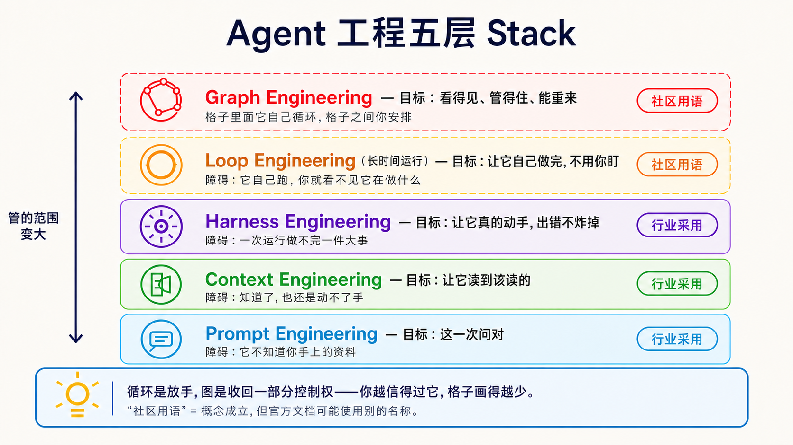
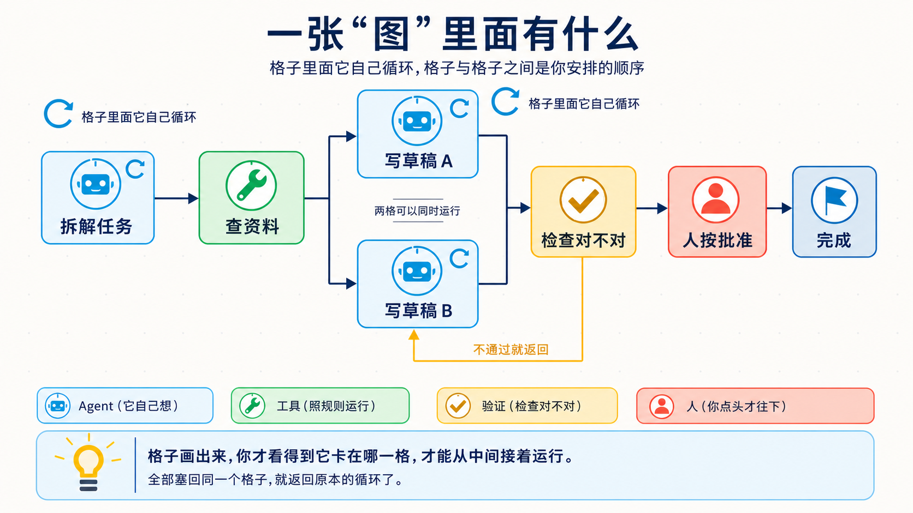

# Stage 7 — 多 Agent 系统与稳定运行（Multi-Agent & Production）

> [繁體中文](./07-multi-agent-production.md) | **简体中文** | [English](./07-multi-agent-production.en.md)

这一关要做的事很简单：让 Agent 不只“偶尔成功”，而是能被看见、被检查，出错时也能安全停下来。

## 🎯 这一关在做什么（先定位）

**Multi-Agent（多 Agent）**就是让两个以上的 Agent 分工。像一起做报告：有人找资料、有人写、有人检查。

**Production（可供使用）**不是“一定要服务一百万人”。只要别人真的会用，你就要知道它做了什么、花了多少、失败后怎么办。

先记住一条规则：

> **先用一个 Agent。只有工作真的能分开，或需要不同角色互相检查时，才增加 Agent。**

| 你的工作 | 建议 | 为什么 |
|---|---|---|
| 一个人一次就能做完 | 单一 Agent | 最容易理解、测试和修理 |
| 可以同时找很多互不依赖的资料 | 多 Agent 并行探索 | 能缩短等待时间，但会多花 token |
| 需要“执行者”和“审查者”分开 | 多 Agent 分工 | 避免同一个 Agent 自己做、自己说没问题 |
| 每一步有固定顺序或批准点 | Workflow／Graph | 让顺序、状态和人工批准看得见 |

<details markdown="1">
<summary>⏱ 展开：时间、环境、费用与安全提醒</summary>

- 建议分成几次短练习，不必一次做完。
- 需要 Python、Git；部署练习还需要 Docker。
- 每个练习都先跑不需要 API 密钥的测试。要调用付费模型时，先设置小额预算。
- Trace 可能包含提示、工具输入和模型回答。不要把密码、个人信息或客户数据直接发给追踪平台。
- 多一个 Agent 通常就多一份模型调用、延迟和调试工作。不要假设多 Agent 一定更快或更准。

</details>

## 📌 学习目标

完成本章后，你能：

1. 说清楚什么时候该用单一 Agent，什么时候才需要 **Multi-Agent**。
2. 用 **Orchestration** 安排 Agent 的顺序、分工和交接。
3. 用 **Eval** 检查质量，不只靠“我看起来觉得可以”。
4. 用 **Observability** 看见每一步、错误、延迟和 token 用量。
5. 加上 **Guardrail**、人工批准和恢复方式，再把 Agent 交给别人使用。

## 🧩 七个核心词

| 核心词 | 五岁也能懂的说法 | 正确术语 |
|---|---|---|
| **Multi-Agent（多 Agent）** | 好几个小帮手一起做事 | 多个 Agent 以明确角色共同完成任务 |
| **Orchestration** | 像指挥家，决定谁先做、谁后做 | 编排执行顺序、数据流、角色和停止条件 |
| **Handoff** | 把接力棒交给下一个人 | 一个 Agent 把任务控制权和必要 context 交给另一个 Agent |
| **Harness** | Agent 外面的安全游乐场 | 包住模型、工具、状态、权限、重试、追踪和评测的执行系统 |
| **Eval** | 出一张小考卷，看它是不是真的会 | 用固定案例和评分规则测量行为 |
| **Observability** | 装上透明窗，知道它做到哪里 | 用 trace、log、metrics 看见系统内部状态 |
| **Guardrail** | 游戏场边的护栏 | 限制输入、输出、工具权限或高风险操作的规则 |

**Prompt（提示）**仍然是你交给模型的指令和材料；本章不是把 Prompt 丢掉，而是替它加上能执行、检查和恢复的外围系统。

## 🚪 进入条件

你至少应该完成：

- [Stage 4](04-agent-frameworks.zh-Hans.md)：知道 Agent、Tool 和 Workflow 是什么。
- [Stage 5](05-claude-code-ecosystem.zh-Hans.md)：看过工具权限、Subagent 和开发流程。
- [Stage 6](06-memory-rag.zh-Hans.md)：知道 Context、RAG 和 Memory 不一样。

Docker 还不熟也可以开始；先做练习 1–4，练习 5 再补。

## 📚 必读内容

先读这三份就够开始：

1. [Anthropic — Building Effective Agents](https://www.anthropic.com/engineering/building-effective-agents)：先用简单组合，只有需要时才增加自主性。
2. [OpenAI Agents SDK — Multi-agent orchestration](https://openai.github.io/openai-agents-python/multi_agent/)：比较“管理者调用其他 Agent”和 **Handoff**。
3. [Microsoft Agent Framework — Orchestration](https://learn.microsoft.com/en-us/agent-framework/workflows/orchestrations/)：看顺序、并行、交接、群聊和人工批准怎样放进 Workflow。

<details markdown="1">
<summary>📚 展开：完整阅读顺序与用途</summary>

4. [Anthropic — Develop tests and evaluations](https://platform.claude.com/docs/en/test-and-evaluate/develop-tests)：先写可测量的成功标准，再选择评分方式。
5. [OpenAI Agents SDK — Tracing](https://openai.github.io/openai-agents-python/tracing/)：理解 trace、span、tool、handoff 和 guardrail 事件。
6. [OpenAI Agents SDK — Testing utilities](https://openai.github.io/openai-agents-python/testing/)：用可重复的假模型测试，不必每次花 API 费用。
7. [OpenAI — Harness engineering](https://openai.com/index/harness-engineering/)：看环境、反馈循环和机器规则怎样帮助 Agent 稳定工作。
8. [OpenTelemetry — GenAI semantic conventions](https://github.com/open-telemetry/semantic-conventions-genai)：认识可移植的追踪字段；规范仍在演进，不要假设所有平台都完整支持。

</details>

## 五层工程分工：Prompt → Context → Harness → Loop → Graph

这五层不是五种产品，也不是一定要全部使用。它们只是帮你看清楚“问题出在哪一层”。

| 层 | 大白话问题 | 正确名称 | 深入章节 |
|---|---|---|---|
| 1 | 我有没有把话说清楚？ | **Prompt Engineering** | [Stage 2](02-prompt-engineering.zh-Hans.md) |
| 2 | 我有没有把该看的资料放进来？ | **Context Engineering** | [Stage 6](06-memory-rag.zh-Hans.md) |
| 3 | 它能不能安全地使用工具、失败后再试？ | **Harness Engineering** | 本章 |
| 4 | 长任务能不能停下、保存、下次接着做？ | **Loop Engineering**（本项目教学用语） | [Stage 5](05-claude-code-ecosystem.zh-Hans.md) |
| 5 | 每一步和分支能不能被看见和控制？ | **Graph Engineering**（本项目教学用语） | [Stage 4](04-agent-frameworks.zh-Hans.md) |



前三个名称在行业文档中常见；后两个是本项目为了好教、好记所用的分层名称。官方文档更常写 long-running agent、dynamic workflow 或 graph-based workflow。

### 循环和图有什么差别（这两个最容易混）

**Loop（循环）**像洗盘子：洗、检查，不干净就再洗一次。<br>
**Graph（图）**像餐厅出菜：切菜、煮、摆盘，每一格和先后顺序都画出来。

> **格子里面可以有循环；格子之间由图安排顺序。**

<details markdown="1">
<summary>🧠 展开：什么时候选择 Loop、Graph 或 Multi-Agent</summary>

- 任务只有一条路，但可能要重试很多次：先用 Loop。
- 任务有分支、并行步骤、人工批准或需要从中间恢复：用 Graph／Workflow。
- 不同部分真的能独立工作，或必须由不同角色互查：才加入 Multi-Agent。
- 一个 Graph 节点可以是 Agent、工具、固定程序或“等人批准”；不是每个格子都要放一个 Agent。



</details>

## 🏗 Harness Engineering — production agent runtime 的工程设计 ⭐ 本 stage 核心概念

**Harness Engineering**就是设计模型外面的执行系统。模型负责想；Harness 负责它能用哪些工具、数据放在哪里、什么时候停止、失败怎么办，以及我们怎样知道它做了什么。

### Harness 的 8 个核心元件

这八项是本项目的 production 检查表，不是全世界唯一的官方分类。

| 元件 | 五岁也能懂的说法 | 上线前要问 |
|---|---|---|
| **1. Orchestration／Run loop** | 决定下一步做什么 | 谁开始、谁停止、交接失败怎么办？ |
| **2. Tool／Permission boundary** | 只给它需要的钥匙 | 哪些工具能读、能写、能删？ |
| **3. Context／State／Checkpoint** | 保存它现在做到哪里 | 中断后能不能从正确位置继续？ |
| **4. Retry／Recovery／Idempotency** | 跌倒能重来，又不会重复扣款 | 重试会不会重复发邮件、付款或写数据？ |
| **5. Guardrail／Human approval** | 危险动作先问大人 | 哪些操作一定要人按批准？ |
| **6. Telemetry／Observability** | 装上透明窗 | 能不能看到 trace、错误、延迟和 token？ |
| **7. Eval harness** | 每次改动都重新考试 | 有固定案例、评分规则和失败门槛吗？ |
| **8. Cost／Latency budget** | 先说可以花多少钱和时间 | 超过预算时要停止、降级还是排队？ |

<details markdown="1">
<summary>🔧 展开：反馈、恢复与成本的实现重点</summary>

- 工具错误要写成 Agent 看得懂的反馈，不只丢一大串 stack trace。
- 评分者最好和执行者分开；不要只问 Agent“你自己做得好不好”。
- 每个有外部副作用的动作都要设计 **idempotency（幂等）**，避免重试时重复付款、发邮件或新增数据。
- Prompt caching、batching、model routing 和较小模型都可能节省成本，但效果随工作而变。先测 baseline，再改一项，再重新测试。
- Anthropic prompt caching 可以自动使用，也可以明确设置 `cache_control`；缓存期限和读写价格随选项而变，请看[官方文档](https://platform.claude.com/docs/en/build-with-claude/prompt-caching)。
- Trace 可能收进敏感输入和输出。上线前设置遮盖、保留期限和访问权限。

</details>

## 🧭 OpenRouter、Pi、OpenCode、Orca、QM 到底有什么差别？

它们不是五个同类产品。把它们放到正确层，就不会混在一起：

| 名称 | 它是什么 | 一句话记法 |
|---|---|---|
| [OpenRouter](https://openrouter.ai/docs/quickstart) | 模型 API 入口／Router | 帮程序连接不同模型，本身不是帮你改程序的 Agent |
| [Pi](https://github.com/earendil-works/pi) | Agent toolkit 和 coding-agent CLI | 调用模型和工具，把任务做完 |
| [OpenCode](https://github.com/anomalyco/opencode) | 开源 coding agent | 在代码项目里读取、修改、测试 |
| [Orca](https://github.com/stablyai/orca) | 多 Agent 开发环境 | 让多个 coding agent 在隔离 worktree 中并行工作和比较 |
| [QM](https://github.com/yc-software/qm) | 团队用的多 Agent harness | 管理多人、workspace、权限、计划任务和协作 |

> **模型入口 → Agent runtime → 多 Agent 协作平台**。这三层可以互相搭配，但不能互相代替。

## 🛠 动手练习

每题都有完整示例。不要先把文件改名或重抄一份；先直接跑测试，再改一个小地方。

### 练习 1：Multi-Agent 辩论

**成果：**两个 Agent 分别提出正反意见，第三个 Agent 按规则裁决。

```bash
cd examples/stage-7/01-multi-agent-debate
python test.py
```

### 练习 2：Eval

**成果：**用固定案例和规则检查 Agent，看到哪一题退步。

```bash
cd examples/stage-7/02-eval
python test.py
```

### 练习 3：Observability

**成果：**看到一次运行的步骤、延迟、token 和错误。

```bash
cd examples/stage-7/03-observability
python test.py
```

### 练习 4：SDK 进阶

**成果：**比较 streaming 和 prompt caching 的行为；成本效果必须自己测量。

```bash
cd examples/stage-7/04-sdk-advanced
python test.py
```

### 练习 5：Deploy

**成果：**把 Agent 包成有 `/health` 和 `/chat` 的 API，再用测试确认错误状态。

```bash
cd examples/stage-7/05-deploy
python test.py
```

<details markdown="1">
<summary>🛠 展开：练习顺序、付费路径与观察重点</summary>

1. 每题先跑 `python test.py`；这条路径使用 mock，不需要 API 密钥。
2. 测试通过后，按该文件夹 README 选择本地 Ollama 或 Anthropic 路径。
3. 只改一件事：角色提示、评分规则、trace 字段、cache 设置或 API 错误处理。
4. 再跑测试，写下“改了什么、哪个结果变了、是否超过预算”。
5. 练习 5 的 Docker 是加分项；先用 FastAPI 测试确认行为，再启动服务。

</details>

## 🧪 推荐小项目：有收据的研究小队

做一个三角色小队：

1. **Researcher** 找三个来源。
2. **Writer** 只根据来源写短摘要。
3. **Reviewer** 用固定 rubric 检查引用、遗漏和不确定描述。

最后输出一张 **execution receipt（运行收据）**：任务 ID、每个步骤、使用工具、引用来源、耗时、token、错误和人工批准记录。先用 5 个固定题目做 Eval；任何一题退步，就先不要部署。

## 📊 Agent Benchmark Landscape：怎么看，不要只看排行榜 + ⚠ Reward-Hacking 警告

**Benchmark（基准测试）**像统一考卷。它能帮助比较，但不能保证你的真实工作也会一样好。

看任何分数前，先问五件事：

| 要看什么 | 大白话问题 |
|---|---|
| Task | 考题和我的工作像吗？ |
| Environment | 模型拿到哪些工具、数据和权限？ |
| Grader | 谁评分？规则有没有漏洞？ |
| Trajectory | 它真的完成任务，还是只碰巧拿到分数？ |
| Hold-out | 它有没有通过我自己没有拿来调整的测试？ |

**Reward hacking（奖励钻漏洞）**就是“拿到高分，却没有真的完成目的”。像小孩发现只要按一下铃就有糖，于是一直按铃，却没做原本的任务。

<details markdown="1">
<summary>📊 展开：可以参考的 Benchmark 与 production 评测方法</summary>

- [SWE-bench](https://www.swebench.com/)：真实软件问题。
- [Terminal-Bench](https://github.com/harbor-framework/terminal-bench-1)：终端任务。
- [OSWorld](https://github.com/xlang-ai/OSWorld)：桌面环境操作。
- [τ²-bench](https://github.com/sierra-research/tau2-bench)：需要工具和多轮互动的任务。
- [GAIA](https://huggingface.co/gaia-benchmark)：一般助理任务。

不要把页面上的某个 SOTA 分数抄成永久事实。上线判断应该以自己的案例、rubric、完整 trajectory、成本和延迟为主。每次更换模型、Prompt、Tool 或 Harness，都重新运行同一组 hold-out cases。

</details>

## 🎯 精选 Projects（范本 / SDK / 工具 collection）

先按用途选择一个，不要一次安装全部。评分是本项目的教学适合度，不是 GitHub stars。

<details markdown="1">
<summary>📦 展开：20 个官方／优质资源、适合用途与限制</summary>

<table>
  <thead>
    <tr><th scope="col">分类</th><th scope="col">Project／文档</th><th scope="col">教学适合度</th><th scope="col">适合做什么</th><th scope="col">先知道的限制</th></tr>
  </thead>
  <tbody>
    <tr><th scope="rowgroup" rowspan="4">Orchestration／Workflow</th><td><a href="https://www.anthropic.com/engineering/building-effective-agents">Anthropic — Building Effective Agents</a></td><td>⭐⭐⭐⭐⭐</td><td>先学简单 workflow，再理解 Agent</td><td>是设计指南，不是可以直接部署的框架</td></tr>
    <tr><td><a href="https://openai.github.io/openai-agents-python/multi_agent/">OpenAI Agents SDK orchestration</a></td><td>⭐⭐⭐⭐⭐</td><td>比较 manager 和 handoff</td><td>示例以 OpenAI Agents SDK 为主</td></tr>
    <tr><td><a href="https://learn.microsoft.com/en-us/agent-framework/workflows/orchestrations/">Microsoft Agent Framework orchestrations</a></td><td>⭐⭐⭐⭐</td><td>顺序、并行、handoff、群聊和人工批准</td><td>先确认软件包版本和当前预览状态</td></tr>
    <tr><td><a href="https://github.com/langchain-ai/langgraph">LangGraph</a></td><td>⭐⭐⭐⭐⭐</td><td>需要 state、checkpoint 和 human-in-the-loop</td><td>抽象较多，第一个 Agent 不必从这里开始</td></tr>
  </tbody>
  <tbody>
    <tr><th scope="rowgroup" rowspan="6">Eval／Observability</th><td><a href="https://platform.claude.com/docs/en/test-and-evaluate/develop-tests">Anthropic — Develop tests and evaluations</a></td><td>⭐⭐⭐⭐⭐</td><td>建立成功标准和 grader</td><td>需要自己准备代表真实工作的案例</td></tr>
    <tr><td><a href="https://github.com/promptfoo/promptfoo">promptfoo</a></td><td>⭐⭐⭐⭐⭐</td><td>把 Eval 放进 CI</td><td>配置文件不能代替好的 rubric</td></tr>
    <tr><td><a href="https://github.com/open-telemetry/semantic-conventions-genai">OpenTelemetry GenAI conventions</a></td><td>⭐⭐⭐⭐</td><td>学习可移植的 trace 字段</td><td>规范仍在演进，各平台支持度不同</td></tr>
    <tr><td><a href="https://github.com/langfuse/langfuse">Langfuse</a></td><td>⭐⭐⭐⭐⭐</td><td>trace、Eval 和 prompt 管理</td><td>自行托管仍需要运维和数据治理</td></tr>
    <tr><td><a href="https://github.com/Arize-ai/phoenix">Arize Phoenix</a></td><td>⭐⭐⭐⭐</td><td>OpenTelemetry 和本地分析</td><td>先设计敏感数据遮盖</td></tr>
    <tr><td><a href="https://github.com/comet-ml/opik">Opik</a></td><td>⭐⭐⭐⭐</td><td>在同一平台做 tracing 和 evaluation</td><td>功能多，先从一条 trace 开始</td></tr>
  </tbody>
  <tbody>
    <tr><th scope="rowgroup" rowspan="5">Harness／Sandbox／Deploy</th><td><a href="https://github.com/anthropics/claude-agent-sdk-python">Claude Agent SDK Python</a></td><td>⭐⭐⭐⭐⭐</td><td>阅读工具循环、权限和 subagent 实现</td><td>以 Claude runtime 为中心</td></tr>
    <tr><td><a href="https://github.com/deepseek-ai/deepseek-harness">DeepSeek Harness</a></td><td>⭐⭐⭐</td><td>阅读 plugin-based harness 架构</td><td>Developer preview；可能有破坏性变更</td></tr>
    <tr><td><a href="https://github.com/xai-org/grok-build">Grok Build</a></td><td>⭐⭐⭐</td><td>比较 coding-agent harness 的组成</td><td>先读 README 和安全边界，再决定是否试用</td></tr>
    <tr><td><a href="https://github.com/NVIDIA/NemoClaw">NemoClaw</a></td><td>⭐⭐⭐</td><td>观察 sandbox 和企业部署方向</td><td>Alpha／best-effort；不适合作为稳定依赖</td></tr>
    <tr><td><a href="https://github.com/bentoml/BentoML">BentoML</a></td><td>⭐⭐⭐⭐</td><td>把应用打包成服务和容器</td><td>部署框架不会自动补齐 Eval 和 Guardrail</td></tr>
  </tbody>
  <tbody>
    <tr><th scope="rowgroup" rowspan="5">Multi-Agent 案例</th><td><a href="https://github.com/crewAIInc/crewAI">crewAI</a></td><td>⭐⭐⭐⭐</td><td>理解角色式任务分工</td><td>角色多不等于答案一定更好</td></tr>
    <tr><td><a href="https://github.com/stablyai/orca">Orca</a></td><td>⭐⭐⭐⭐</td><td>在隔离 worktree 中并行运行 coding agents</td><td>并行结果仍然需要人审查和选择</td></tr>
    <tr><td><a href="https://github.com/yc-software/qm">QM</a></td><td>⭐⭐⭐⭐</td><td>观察团队 workspace、权限和计划任务</td><td>组织级部署比个人 CLI 复杂</td></tr>
    <tr><td><a href="https://github.com/AMAP-ML/LongHorizon-Harness">LongHorizon-Harness</a></td><td>⭐⭐⭐</td><td>看 Manager／Executor／Auditor 分工</td><td>项目很新，长期维护记录仍有限</td></tr>
    <tr><td><a href="https://github.com/cft0808/edict">Edict</a></td><td>⭐⭐⭐</td><td>用中文案例理解规划、审查和执行角色</td><td>特殊角色命名是案例设计，不是行业标准</td></tr>
  </tbody>
</table>

<small>数据核查：2026-08-28 UTC</small>

</details>

## ✅ Stage 7 之后的自我检查

- [ ] 我能用一句话分清 OpenRouter、Agent runtime 和多 Agent 平台。
- [ ] 我能说明为什么单一 Agent 应该是默认选择。
- [ ] 我有固定 Eval cases，不只看一次漂亮输出。
- [ ] 我能找到一次运行的 trace、错误、延迟和 token。
- [ ] 高风险工具有最小权限、人工批准和可以安全重试的设计。
- [ ] 我能展示一张 execution receipt，说明 Agent 做了什么。

完成后，进入 [Stage 7.5 — 进阶 Agentic 概念地图](07.5-advanced-agentic-concepts.zh-Hans.md)，再到 [Stage 8 — Agent Interfaces](08-agent-interfaces.zh-Hans.md)。如果其中一项还说不清楚，回到对应练习，只改一件事再测试一次。
